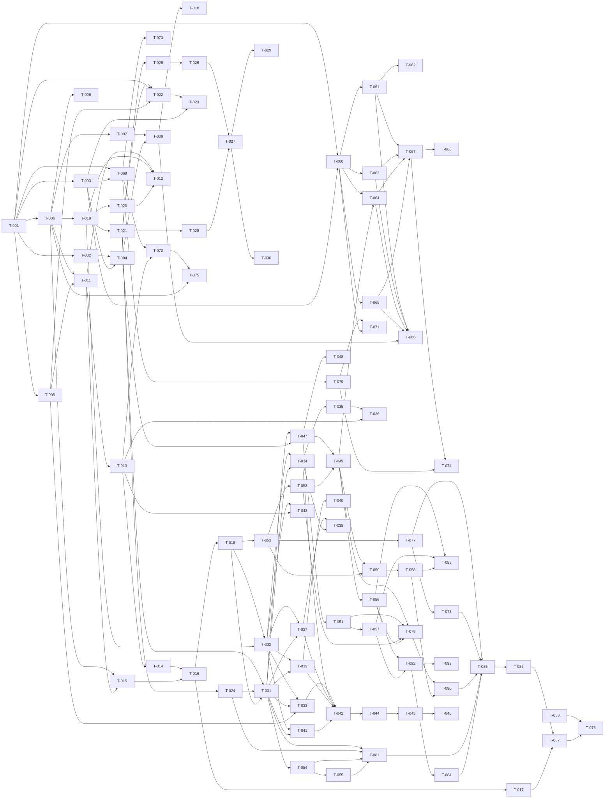

# Build Site: autoresearch-tree

Decomposition of 7 cavekits, 59 requirements, and 236 acceptance criteria into executable tasks for parallel Claude builders. Each task carries an explicit cavekit requirement reference, a list of mapped acceptance criteria, an effort size, files to touch, a test strategy, and a `blockedBy` dependency edge so an unblocked-task selector can pick parallel work safely.

## Task Decomposition

### Domain: graph-core (10 R, 40 criteria, T-001..T-018)

#### T-001: Generic node primitive structure
- **Cavekit Requirement:** graph-core/R1
- **Acceptance Criteria Mapped:** R1.1 (id/type/payload_ref/parents/children/tags exposed; nothing else mandatory), R1.2 (no-parent root and no-child leaf accepted), R1.4 (tags is a set of strings independent of typed links)
- **blockedBy:** none
- **Effort:** M
- **Description:** Implement a `Node` dataclass/record with exactly the six fields. Type is a string (deferred semantic meaning to schema-registry). `parents`/`children` are sets of node-id strings. `tags` is a separate set[str]. Provide constructors that default to empty parents/children/tags, and accept a payload_ref of None. Expose only these fields publicly; do not auto-add fields like timestamps at this layer.
- **Files:** `agi-tree/src/graph_core/node.py`, `agi-tree/tests/graph_core/test_node.py`
- **Test Strategy:** Unit tests asserting (a) field set is exactly the six declared, (b) Node() with no parents is a root, (c) Node() with no children is a leaf, (d) tags being mutated does not affect parents/children.

#### T-002: Node parent/child invariant guards (no duplicates, no self-loops)
- **Cavekit Requirement:** graph-core/R1
- **Acceptance Criteria Mapped:** R1.3 (parents/children are sets — no duplicates; self-loops rejected with clear error)
- **blockedBy:** T-001
- **Effort:** S
- **Description:** Add validators that reject inserting a node id into its own parents/children set with a `SelfLoopError` carrying the offending id; ensure set semantics naturally drop duplicates. Surface a structured exception type.
- **Files:** `agi-tree/src/graph_core/node.py`, `agi-tree/src/graph_core/errors.py`, `agi-tree/tests/graph_core/test_node_invariants.py`
- **Test Strategy:** Unit test attempts to add `n.id` to `n.children`; expects `SelfLoopError` with the id in the message. Unit test inserts duplicate child and asserts size unchanged.

#### T-003: Generic edge primitive
- **Cavekit Requirement:** graph-core/R2
- **Acceptance Criteria Mapped:** R2.2 (edge exposes source_id/target_id/relation/optional tags), R2.3 (idempotent insert for same source/target/relation triple)
- **blockedBy:** T-001
- **Effort:** S
- **Description:** Implement `Edge` record with exactly four fields. Equality and hashing are based on `(source_id, target_id, relation)` so a set of edges naturally deduplicates.
- **Files:** `agi-tree/src/graph_core/edge.py`, `agi-tree/tests/graph_core/test_edge.py`
- **Test Strategy:** Unit test inserts the same edge triple twice into a set; expects len 1. Asserts field surface.

#### T-004: Graph DAG insertion with cycle rejection
- **Cavekit Requirement:** graph-core/R2
- **Acceptance Criteria Mapped:** R2.1 (cycle insert returns structured error and leaves graph unchanged), R2.4 (removing node removes all incident edges, no dangling refs)
- **blockedBy:** T-002, T-003
- **Effort:** M
- **Description:** Implement a `Graph` container that holds nodes by id and edges as a set, exposes `add_node`, `add_edge`, `remove_node`, and `remove_edge`. `add_edge` performs cycle detection via DFS from target back to source; on a cycle, raises `CycleError` and rolls back. `remove_node` filters out every incident edge.
- **Files:** `agi-tree/src/graph_core/graph.py`, `agi-tree/tests/graph_core/test_graph_dag.py`
- **Test Strategy:** Unit test attempts to insert an edge that closes a 3-cycle and asserts the graph state matches a snapshot taken before the call. Unit test removes a node with two incoming and three outgoing edges and asserts the edge set drops by exactly five.

#### T-005: Identity scheme (slug + collision suffix + length warning)
- **Cavekit Requirement:** graph-core/R3
- **Acceptance Criteria Mapped:** R3.1 (`<type-prefix>:<short-slug>`, slug is kebab-case 2..5 words), R3.2 (collision gets `:n` starting at `:2`), R3.3 (>40 chars triggers non-fatal warning), R3.4 (stable across rebuilds from same source files)
- **blockedBy:** T-001
- **Effort:** M
- **Description:** Implement `mint_id(type_prefix, source_text)` and `IdRegistry`. Slug derivation is deterministic: lowercase, strip punctuation, split on whitespace, take first 2–5 tokens (configurable cap), join with `-`. Registry tracks issued ids; on collision, append `:2`, `:3`, ... in stable insertion order. Warn (via Python `warnings`) when the resulting id exceeds 40 chars but still return it. Stability comes from feeding the same source-text deterministically.
- **Files:** `agi-tree/src/graph_core/identity.py`, `agi-tree/tests/graph_core/test_identity.py`
- **Test Strategy:** Unit tests: same input twice yields same id; collision yields `:2` then `:3`; long input raises a `UserWarning`. Stability test: feed a sorted list of source texts twice and compare id sequences for byte equality.

#### T-006: Node file frontmatter persistence (Markdown + JSON containers)
- **Cavekit Requirement:** graph-core/R4
- **Acceptance Criteria Mapped:** R4.2 (load-then-save round-trips byte-equivalent modulo whitespace), R4.3 (Markdown-with-YAML or pure JSON files accepted)
- **blockedBy:** T-001
- **Effort:** M
- **Description:** Implement a frontmatter reader/writer. For `.md` files, parse a `---` YAML block then body. For `.json` files, treat the file as `{frontmatter:..., body:...}`. Write paths preserve a normalized form (consistent line endings, sorted top-level keys). Round-trip test feeds a known fixture, loads, saves, then asserts file equivalence after whitespace normalization.
- **Files:** `agi-tree/src/graph_core/persistence/frontmatter.py`, `agi-tree/tests/graph_core/test_frontmatter.py`, `agi-tree/tests/fixtures/nodes/sample.md`, `agi-tree/tests/fixtures/nodes/sample.json`
- **Test Strategy:** Round-trip test on both md and json fixtures. Test that no body content is read when only frontmatter is requested.

#### T-007: Lazy body loading
- **Cavekit Requirement:** graph-core/R4
- **Acceptance Criteria Mapped:** R4.1 (loading reads only frontmatter; body fetched on first body access)
- **blockedBy:** T-006
- **Effort:** S
- **Description:** Wrap node body in a `LazyBody` object. The graph load path reads only the frontmatter region of each file. `node.body` is a property that triggers the on-disk read on first access.
- **Files:** `agi-tree/src/graph_core/persistence/lazy_body.py`, `agi-tree/tests/graph_core/test_lazy_body.py`
- **Test Strategy:** Counter-based test wrapping the file reader; asserts no body reads occur during graph load and exactly one body read occurs after first `node.body` access.

#### T-008: Frontmatter error isolation
- **Cavekit Requirement:** graph-core/R4
- **Acceptance Criteria Mapped:** R4.4 (malformed frontmatter produces structured error naming the offending file; rest of load proceeds)
- **blockedBy:** T-006
- **Effort:** S
- **Description:** Wrap each per-file load in a try/except that emits a `FrontmatterError(path, reason)` into a structured error list and skips the offending file. Graph load returns both the loaded node set and the error list.
- **Files:** `agi-tree/src/graph_core/persistence/frontmatter.py`, `agi-tree/src/graph_core/errors.py`, `agi-tree/tests/graph_core/test_frontmatter_errors.py`
- **Test Strategy:** Load directory containing one valid and one malformed node file; assert one node loaded and one error reported with the correct path.

#### T-009: Recursive node bodies (`subgraph: true`)
- **Cavekit Requirement:** graph-core/R5
- **Acceptance Criteria Mapped:** R5.1 (subgraph:true treats body as graph using same loader), R5.2 (>=3 levels of nesting without special case), R5.4 (parent query exposes outer children plus inner subgraph handle)
- **blockedBy:** T-007, T-004
- **Effort:** M
- **Description:** When a loaded node's frontmatter contains `subgraph: true`, recursively invoke the directory loader on its body content. Expose the inner graph via `node.subgraph` (a `Graph` instance). Outer parent queries continue to work as before; the subgraph is opaque from outside.
- **Files:** `agi-tree/src/graph_core/loader.py`, `agi-tree/tests/graph_core/test_recursive_bodies.py`, `agi-tree/tests/fixtures/nested/level_a/level_b/level_c/leaf.md`
- **Test Strategy:** Three-level fixture loaded; assert `graph.get(a).subgraph.get(b).subgraph.get(c)` resolves with no special-case branches in the loader.

#### T-010: Uniform renderer input contract (recursive)
- **Cavekit Requirement:** graph-core/R5
- **Acceptance Criteria Mapped:** R5.3 (renderers invoked uniformly on top-level and nested subgraphs using same input contract)
- **blockedBy:** T-009
- **Effort:** S
- **Description:** Document and enforce that any function accepting a `Graph` accepts both top-level and nested subgraph instances without type discrimination. Add an internal `RenderableGraph` typing alias so renderers (built later) inherit this contract.
- **Files:** `agi-tree/src/graph_core/types.py`, `agi-tree/tests/graph_core/test_uniform_contract.py`
- **Test Strategy:** Type test confirms `Graph` instances from outer and inner graphs share the same protocol; passing both into a stub callable returns equivalent shape.

#### T-011: Directory-walking loader (deterministic)
- **Cavekit Requirement:** graph-core/R6
- **Acceptance Criteria Mapped:** R6.1 (point loader at directory; nodes correspond to files), R6.4 (deterministic walk order; identical node set and id order across runs)
- **blockedBy:** T-006, T-005
- **Effort:** M
- **Description:** Walk a directory using `os.walk` with explicit sort on entries at every level. For each file, mint an id via T-005 and load via T-006. Add a fixed seed mechanism to break ties.
- **Files:** `agi-tree/src/graph_core/loader.py`, `agi-tree/tests/graph_core/test_walk_determinism.py`
- **Test Strategy:** Walk the same fixture directory twice; assert id sequences are byte-equal.

#### T-012: Subdirectory→subgraph node resolution via schema-registry
- **Cavekit Requirement:** graph-core/R6
- **Acceptance Criteria Mapped:** R6.2 (subdirectory loaded as subgraph node whose type resolved through schema-registry), R6.3 (files not matching any schema load as generic with warning listing them)
- **blockedBy:** T-011, T-019, T-020
- **Effort:** M
- **Description:** When loader encounters a subdirectory, it asks the schema-registry to resolve the directory name into a node type. Falls back to generic node type when no match. Emits a single aggregated warning naming each unmatched file.
- **Files:** `agi-tree/src/graph_core/loader.py`, `agi-tree/tests/graph_core/test_loader_schema_resolution.py`
- **Test Strategy:** Loader test against fixture with one schema-matched directory and one unmatched; assert correct types and one aggregated warning.

#### T-013: Warm-load cache with content-addressed digest
- **Cavekit Requirement:** graph-core/R7
- **Acceptance Criteria Mapped:** R7.1 (second load returns within noise floor), R7.2 (modifying any node file invalidates cache), R7.3 (cache key includes content-addressed digest so renaming is detected)
- **blockedBy:** T-011
- **Effort:** M
- **Description:** Wrap the loader in an `lru_cache`-style memoizer keyed on `(directory_path, content_digest)`. The digest is computed by hashing a sorted list of `(relative_path, sha256(file_bytes))` tuples. Second load with unchanged source yields the cached graph object.
- **Files:** `agi-tree/src/graph_core/cache.py`, `agi-tree/tests/graph_core/test_warm_load.py`
- **Test Strategy:** Time first vs second load via `time.perf_counter`; second-call elapsed must be at most an order of magnitude over no-op (define a 1ms ceiling for the test fixture). Mutate one file and assert the next load takes more than the noise threshold.

#### T-014: Cache state lives under project context dir
- **Cavekit Requirement:** graph-core/R7
- **Acceptance Criteria Mapped:** R7.4 (cache state lives under context dir; never under absolute external paths)
- **blockedBy:** T-013
- **Effort:** S
- **Description:** Cache files (digest manifests, pickled graph snapshots) live at `<project_root>/context/.cache/graph/`. Configurable only through a context-relative path; reject configurations that resolve outside the project root.
- **Files:** `agi-tree/src/graph_core/cache.py`, `agi-tree/tests/graph_core/test_cache_locality.py`
- **Test Strategy:** Test that cache file paths are resolved relative to the project root and that an attempt to set an absolute external path raises a `PathOutsideProjectError`.

#### T-015: Pluggable persistence backend contract
- **Cavekit Requirement:** graph-core/R8
- **Acceptance Criteria Mapped:** R8.1 (backend implements load/save/list/watch; graph-core depends only on contract), R8.2 (swap to in-memory stub in tests changes no caller code), R8.3 (default install requires no external service), R8.4 (backend selectable via configuration)
- **blockedBy:** T-006, T-011
- **Effort:** M
- **Description:** Define a `PersistenceBackend` Protocol with `load(path)`, `save(path, node)`, `list(path)`, `watch(path)`. Filesystem backend is the default implementation. Provide an `InMemoryBackend` for tests. Configuration via `context/config/graph-core.toml` selects which backend to use.
- **Files:** `agi-tree/src/graph_core/persistence/backend.py`, `agi-tree/src/graph_core/persistence/filesystem.py`, `agi-tree/src/graph_core/persistence/in_memory.py`, `agi-tree/tests/graph_core/test_backend_swap.py`
- **Test Strategy:** Run the same loader test suite once with the filesystem backend and once with the in-memory backend; assert outputs equal. Confirm filesystem backend has no `import requests` or socket usage.

#### T-016: Portability contract — relative paths only
- **Cavekit Requirement:** graph-core/R9
- **Acceptance Criteria Mapped:** R9.1 (no node/cache/config file references absolute path outside project root), R9.2 (copying context dir to fresh checkout reproduces graph), R9.3 (loads with no env vars beyond optional model selector)
- **blockedBy:** T-014, T-015
- **Effort:** M
- **Description:** Audit every path-handling site to use `Path(project_root) / relative`. Reject configuration values containing absolute paths outside the project root. Document the optional model-selector env var as the only permitted environment dependency.
- **Files:** `agi-tree/src/graph_core/paths.py`, `agi-tree/tests/graph_core/test_portability.py`
- **Test Strategy:** Copy fixture context dir to `/tmp/<random>/`, load, assert node count and id list match the original site.

#### T-017: Portability self-test command
- **Cavekit Requirement:** graph-core/R9
- **Acceptance Criteria Mapped:** R9.4 (self-test command verifies portability by reloading from temporary copy and comparing node counts and ids)
- **blockedBy:** T-016
- **Effort:** S
- **Description:** Implement `agi-tree self-test portability` CLI subcommand. Copies `context/` to a tempdir, loads from there, compares node counts and id lists with the original. Exit code 0 on match, non-zero with diff on mismatch.
- **Files:** `agi-tree/src/graph_core/cli/self_test.py`, `agi-tree/tests/graph_core/test_self_test_portability.py`
- **Test Strategy:** Invoke the subcommand on a fixture context dir; assert exit 0 and a "portable: yes" line in stdout.

#### T-018: Bootstrap command
- **Cavekit Requirement:** graph-core/R10
- **Acceptance Criteria Mapped:** R10.1 (empty dir → context skeleton with subdirs schemas/kits/storage), R10.2 (running twice is no-op, no overwrite), R10.3 (skeleton includes minimal example node and schema sufficient to load), R10.4 (reports created paths in single summary)
- **blockedBy:** T-016
- **Effort:** M
- **Description:** Implement `agi-tree bootstrap` CLI. Creates `context/{schemas,kits,nodes,plans,impl,refs,designs}` if missing. Writes a minimal `[example].md` schema and `nodes/example.md` referencing it. Idempotent: existing files are not touched. Prints a summary of created vs skipped paths.
- **Files:** `agi-tree/src/graph_core/cli/bootstrap.py`, `agi-tree/src/graph_core/templates/example_schema.md`, `agi-tree/src/graph_core/templates/example_node.md`, `agi-tree/tests/graph_core/test_bootstrap.py`
- **Test Strategy:** Run bootstrap on empty tempdir; assert directory tree matches expected. Run twice; assert second run reports zero changes and no file's mtime changed.

### Domain: schema-registry (8 R, 32 criteria, T-019..T-031)

#### T-019: Schema as file with naming convention
- **Cavekit Requirement:** schema-registry/R1
- **Acceptance Criteria Mapped:** R1.1 (schema lives at known context path with documented naming), R1.2 (adding new schema file makes node type available without code changes/restart), R1.4 (Markdown-with-frontmatter or structured-data file accepted)
- **blockedBy:** T-006
- **Effort:** M
- **Description:** Schemas live under `context/schemas/`. Naming: `name.md` for inactive, `[name].md` for active (R2 covers brackets). Loader iterates the directory; reuses T-006 frontmatter reader. Both `.md` and `.json` accepted.
- **Files:** `agi-tree/src/schema_registry/loader.py`, `agi-tree/tests/schema_registry/test_schema_files.py`, `agi-tree/tests/fixtures/schemas/example.md`, `agi-tree/tests/fixtures/schemas/example.json`
- **Test Strategy:** Drop a new schema file into a fixture and assert it appears in the registry on next load without code changes.

#### T-091: Schema removal handling with generic fallback warning
- **Cavekit Requirement:** schema-registry/R1
- **Acceptance Criteria Mapped:** R1.3 (removing schema makes type unavailable next load; existing nodes of that type fall back to generic with warning)
- **blockedBy:** T-019
- **Effort:** S
- **Description:** When a previously-loaded schema is no longer present, mark its type as removed. Nodes that referenced it on next load fall through to the generic schema and emit a single warning per missing schema name.
- **Files:** `agi-tree/src/schema_registry/loader.py`, `agi-tree/tests/schema_registry/test_schema_removal.py`
- **Test Strategy:** Load fixture with `[t].md`, then delete it, then reload; assert nodes of type `t` map to generic and a warning is emitted naming `t`.

#### T-021: Bracket convention for active schemas
- **Cavekit Requirement:** schema-registry/R2
- **Acceptance Criteria Mapped:** R2.1 (bracketed file is in active set), R2.2 (no brackets → loaded but inactive, excluded from auto-discovery), R2.3 (activating = renaming to add brackets), R2.4 (two bracketed schemas claiming same name → load failure naming both)
- **blockedBy:** T-019
- **Effort:** M
- **Description:** Implement `is_active = filename.startswith('[') and filename.endswith(']')`. Track active vs inactive sets separately. On collision among active schemas, raise `DuplicateActiveSchemaError(names=[path1, path2])`.
- **Files:** `agi-tree/src/schema_registry/active_set.py`, `agi-tree/tests/schema_registry/test_brackets.py`
- **Test Strategy:** Tests for each of the four criteria, including renaming an inactive file mid-test and reloading.

#### T-022: Schemas as `meta_node` in graph
- **Cavekit Requirement:** schema-registry/R3
- **Acceptance Criteria Mapped:** R3.1 (one meta_node per registered schema; id derived from schema name), R3.2 (meta-node frontmatter exposes declared fields/defaults/rules), R3.4 (removing schema removes meta-node and validating edges next load)
- **blockedBy:** T-021, T-001, T-005
- **Effort:** M
- **Description:** During registry load, synthesize one node of `type=meta_node` per registered schema. Use the schema's name to mint a deterministic id. The meta-node's frontmatter mirrors the schema's declared fields, defaults, and validation rule references.
- **Files:** `agi-tree/src/schema_registry/meta_nodes.py`, `agi-tree/tests/schema_registry/test_meta_nodes.py`
- **Test Strategy:** Load registry; assert each schema name has a corresponding meta_node in the output graph, with frontmatter containing fields/defaults/rules.

#### T-023: Validating edges from meta-nodes to ordinary nodes
- **Cavekit Requirement:** schema-registry/R3
- **Acceptance Criteria Mapped:** R3.3 (edges from meta_node instances to ordinary nodes record which schema validated which node)
- **blockedBy:** T-022, T-003
- **Effort:** S
- **Description:** After validating a node against its schema, insert a `validated_by` edge from the meta-node to the ordinary node.
- **Files:** `agi-tree/src/schema_registry/validation_edges.py`, `agi-tree/tests/schema_registry/test_validation_edges.py`
- **Test Strategy:** Load fixture; for each ordinary node, assert exactly one validated_by edge from the corresponding meta-node.

#### T-024: Optional validation hook engine
- **Cavekit Requirement:** schema-registry/R4
- **Acceptance Criteria Mapped:** R4.1 (no rule → no per-field checks), R4.2 (rule → reject violators with structured per-node error), R4.3 (validation errors do not abort rest of load), R4.4 (validation results queryable, e.g. failure counts per schema)
- **blockedBy:** T-021
- **Effort:** M
- **Description:** Schema frontmatter may include a `validation` rule (declarative DSL — required-fields, type-checks, regex). Loader runs the rule against each candidate node. Each failure becomes a `ValidationError(node_id, schema, reason)` collected into the load result. Provide `registry.failures_by_schema()` query.
- **Files:** `agi-tree/src/schema_registry/validation.py`, `agi-tree/src/schema_registry/dsl.py`, `agi-tree/tests/schema_registry/test_validation.py`
- **Test Strategy:** Two fixtures (one with rules, one without). With rules, assert violators are listed but valid nodes still load. Without rules, no per-field checks. `failures_by_schema()` returns expected counts.

#### T-025: Auto-discovery cascade — bracket name match (step 1)
- **Cavekit Requirement:** schema-registry/R5
- **Acceptance Criteria Mapped:** R5.1 (bracketed schema matches by name → selected, later steps skipped)
- **blockedBy:** T-021
- **Effort:** S
- **Description:** Implement step 1 of the cascade. Given a directory name `foo`, look up `[foo].md` in the active set. On match, return that schema and short-circuit.
- **Files:** `agi-tree/src/schema_registry/cascade.py`, `agi-tree/tests/schema_registry/test_cascade_step_1.py`
- **Test Strategy:** Place `[idea].md` in the schemas dir; load directory `idea/` and assert the matching schema is selected.

#### T-026: Auto-discovery cascade — fingerprint similarity (step 2)
- **Cavekit Requirement:** schema-registry/R5
- **Acceptance Criteria Mapped:** R5.2 (no name match → compare observed frontmatter shape against schemas; pick best match if similarity >= 0.7)
- **blockedBy:** T-025
- **Effort:** M
- **Description:** Step 2: compute a fingerprint (set of frontmatter keys) for files in the directory and the union over all registered schemas. Score = Jaccard similarity. Pick the schema with the highest score >= 0.7.
- **Files:** `agi-tree/src/schema_registry/fingerprint.py`, `agi-tree/tests/schema_registry/test_cascade_step_2.py`
- **Test Strategy:** Fixture with directory whose files share 70% of fields with one schema; assert that schema is selected.

#### T-027: Auto-discovery cascade — language-model fallback (step 3)
- **Cavekit Requirement:** schema-registry/R5
- **Acceptance Criteria Mapped:** R5.3 (similarity < threshold and hook available → hook proposes schema, written without brackets pending review)
- **blockedBy:** T-026, T-028
- **Effort:** M
- **Description:** Step 3: invoke the configured LM hook with the directory's frontmatter samples. The hook returns proposed schema YAML. Validate the proposal (via T-028 hook output validation), write to `context/schemas/<name>.md` (no brackets), and use generic fallback for the current load.
- **Files:** `agi-tree/src/schema_registry/cascade.py`, `agi-tree/tests/schema_registry/test_cascade_step_3.py`
- **Test Strategy:** Stub hook returning a known YAML; assert file is written without brackets and the directory falls back to generic for this load.

#### T-028: Pluggable LM hook with graceful degradation
- **Cavekit Requirement:** schema-registry/R6
- **Acceptance Criteria Mapped:** R6.1 (hook target selectable via config/env, not hard-coded), R6.2 (no target/unreachable → cascade proceeds to generic without raising), R6.3 (hook failure logged with offending input; does not abort load), R6.4 (hook outputs validated before written)
- **blockedBy:** T-021
- **Effort:** M
- **Description:** Implement `LanguageModelHook` Protocol with `propose_schema(samples)` returning a candidate dict. Implementations chosen via `context/config/schema-registry.toml` `hook=` value (claude/ollama/none). Wrap calls in `try/except` with structured logging and a strict YAML schema validator on outputs.
- **Files:** `agi-tree/src/schema_registry/hooks/protocol.py`, `agi-tree/src/schema_registry/hooks/claude.py`, `agi-tree/src/schema_registry/hooks/none.py`, `agi-tree/tests/schema_registry/test_hooks.py`
- **Test Strategy:** Unit tests injecting (a) None hook → cascade reaches generic, (b) failing hook → error logged, load continues, (c) malformed output → rejected by validator.

#### T-029: Cascade fallback to generic with unmatched-files warning (step 4)
- **Cavekit Requirement:** schema-registry/R5
- **Acceptance Criteria Mapped:** R5.4 (all earlier steps fail → generic schema with warning listing each unmatched file)
- **blockedBy:** T-027
- **Effort:** S
- **Description:** Final cascade step. Load all files under the unmatched directory as generic nodes. Emit one aggregated warning listing every unmatched file.
- **Files:** `agi-tree/src/schema_registry/cascade.py`, `agi-tree/tests/schema_registry/test_cascade_step_4.py`
- **Test Strategy:** Fixture directory with no matching schema and no hook; assert generic loading and warning content.

#### T-030: Generated schemas land inactive with provenance
- **Cavekit Requirement:** schema-registry/R7
- **Acceptance Criteria Mapped:** R7.1 (hook-generated file written without brackets; not added to active set this load), R7.2 (subsequent load after user adds brackets → active), R7.3 (provenance metadata: timestamp, source dir, hook target in frontmatter), R7.4 (two consecutive runs invoking hook for same dir do not produce duplicates)
- **blockedBy:** T-027
- **Effort:** M
- **Description:** Generated schema files are named `<name>.md` (no brackets). Frontmatter includes `provenance: {generated_at, source_dir, hook_target}`. Idempotency check: hash the source-dir fingerprint and skip writing if a file with the same hash already exists.
- **Files:** `agi-tree/src/schema_registry/generation.py`, `agi-tree/tests/schema_registry/test_schema_generation.py`
- **Test Strategy:** Run cascade twice with the same input; assert one file written and second run is a no-op. Verify provenance fields. Rename to bracketed and reload; assert active.

#### T-031: Built-in schemas for autoresearch types
- **Cavekit Requirement:** schema-registry/R8
- **Acceptance Criteria Mapped:** R8.1 (after bootstrap, registry has active schemas idea/hypothesis/experiment/verdict/mvp/outcome/bigger_outcome/app_purpose), R8.2 (each declares required fields, including verdict taxonomy fields where applicable), R8.3 (overridable by user-supplied bracketed schema of same name without code changes), R8.4 (removing built-in → downstream features report clear missing-schema error rather than crashing)
- **blockedBy:** T-021, T-024, T-018
- **Effort:** L
- **Description:** Ship eight bracketed schema files in `agi-tree/src/graph_core/templates/builtin_schemas/`. Bootstrap copies them into `context/schemas/`. Verdict schema declares `state`, `confidence`, `evidence_runs`, `contradicts`, `supports`. User override mechanism: any user-placed `[<same-name>].md` shadows the built-in (built-in skipped on copy). Downstream callers of missing built-ins receive `MissingBuiltinSchemaError`.
- **Files:** `agi-tree/src/graph_core/templates/builtin_schemas/[idea].md`, `[hypothesis].md`, `[experiment].md`, `[verdict].md`, `[mvp].md`, `[outcome].md`, `[bigger_outcome].md`, `[app_purpose].md`, `agi-tree/src/schema_registry/builtins.py`, `agi-tree/tests/schema_registry/test_builtins.py`
- **Test Strategy:** Bootstrap test asserts all eight schemas present and active. Override test places `[verdict].md` and asserts user version is used. Removal test asserts a `MissingBuiltinSchemaError` is surfaced rather than crashing.

### Domain: environment-indexers (9 R, 36 criteria, T-032..T-046)

#### T-032: Indexer invocation command (target+name, listing, error handling)
- **Cavekit Requirement:** environment-indexers/R1
- **Acceptance Criteria Mapped:** R1.1 (command accepts target path + indexer name; runs only that one), R1.2 (listing without invocation → summary with name + one-line description), R1.3 (unknown indexer name → structured error, runs nothing), R1.4 (non-zero exit when failure prevented node emission)
- **blockedBy:** T-018, T-019
- **Effort:** M
- **Description:** Implement `agi-tree index <name> <path>` and `agi-tree index --list`. Indexers register themselves with name + description via a decorator. Unknown name → `UnknownIndexerError`. Failures during emission propagate as non-zero CLI exits.
- **Files:** `agi-tree/src/environment_indexers/cli.py`, `agi-tree/src/environment_indexers/registry.py`, `agi-tree/tests/environment_indexers/test_cli.py`
- **Test Strategy:** CLI tests covering each criterion. Mock indexer registration to simulate failure path.

#### T-033: Filesystem tree indexer
- **Cavekit Requirement:** environment-indexers/R2
- **Acceptance Criteria Mapped:** R2.1 (one node per dir + child node per file/subdir), R2.2 (frontmatter conforms to filesystem-tree schema), R2.3 (symlinks/unreadable entries skipped with per-entry warning, run continues), R2.4 (re-running yields same ids and parent-child links)
- **blockedBy:** T-032, T-031, T-005
- **Effort:** M
- **Description:** `filesystem_tree` indexer walks the target. Emits a `directory` node per dir and `file` node per file. Skips symlinks/unreadable with a per-entry warning. Determinism comes from sorted walking + T-005 id minting.
- **Files:** `agi-tree/src/environment_indexers/filesystem_tree.py`, `agi-tree/src/environment_indexers/schemas/[filesystem_tree].md`, `agi-tree/tests/environment_indexers/test_filesystem_tree.py`
- **Test Strategy:** Run indexer twice on a fixture (with one symlink and one chmod-000 file); assert id stability and that warnings list the skipped entries.

#### T-034: Code symbol indexer — node emission for functions/classes/methods/modules
- **Cavekit Requirement:** environment-indexers/R3
- **Acceptance Criteria Mapped:** R3.1 (emits at minimum function, class, method, module nodes for supported language)
- **blockedBy:** T-032, T-031
- **Effort:** L
- **Description:** Python-first AST-based parser (use stdlib `ast`). Emits `module`, `class`, `function`, `method` node types. Inspired by `agi/graph_builder.py` lru_cache pattern but re-implemented under schema-registry contracts. Documented as Python-only for v1.
- **Files:** `agi-tree/src/environment_indexers/code_symbols.py`, `agi-tree/src/environment_indexers/schemas/[module].md`, `[class].md`, `[function].md`, `[method].md`, `agi-tree/tests/environment_indexers/test_code_symbols_emit.py`
- **Test Strategy:** Index a fixture Python project with one of each symbol type; assert all four are present in the output graph.

#### T-035: Code symbol indexer — caller/callee relationship edges
- **Cavekit Requirement:** environment-indexers/R3
- **Acceptance Criteria Mapped:** R3.2 (graph contains relationship edges sufficient to answer "callers of X" and "callees of X")
- **blockedBy:** T-034
- **Effort:** M
- **Description:** Augment T-034 with `calls` edges from caller symbol to callee symbol (best-effort name resolution within the indexed project; cross-package calls flagged as `external_call`). Add `callers_of(id)` and `callees_of(id)` query helpers.
- **Files:** `agi-tree/src/environment_indexers/code_symbols.py`, `agi-tree/src/environment_indexers/code_symbol_queries.py`, `agi-tree/tests/environment_indexers/test_call_edges.py`
- **Test Strategy:** Fixture with `a()` calling `b()` calling `c()`; assert `callers_of('c')` returns `b` and `callees_of('a')` returns `b`.

#### T-036: Code symbol indexer — warm-load and upgrade markers
- **Cavekit Requirement:** environment-indexers/R3
- **Acceptance Criteria Mapped:** R3.3 (warm-loads in time indistinguishable from no-op on unchanged repo), R3.4 (inline comments flag at least one upgrade point per major parsing stage)
- **blockedBy:** T-035, T-013
- **Effort:** M
- **Description:** Reuse T-013 warm-load cache for the indexer's per-path output. Add inline `# UPGRADE-MARKER:` comments naming the upgradable concern in each parsing stage (lex, parse, symbol-resolve, edge-emit) — at least one per stage.
- **Files:** `agi-tree/src/environment_indexers/code_symbols.py`, `agi-tree/tests/environment_indexers/test_code_symbols_warm.py`
- **Test Strategy:** Time second run on unchanged fixture; must be within noise floor. Grep `UPGRADE-MARKER:` and assert >= 4 hits.

#### T-037: Python dependency indexer — package nodes from declarations
- **Cavekit Requirement:** environment-indexers/R4
- **Acceptance Criteria Mapped:** R4.1 (one node per declared package dependency), R4.3 (both requirements.txt-style and pyproject.toml-style supported), R4.4 (neither file present → structured error, no nodes)
- **blockedBy:** T-032, T-031
- **Effort:** M
- **Description:** Parse `requirements.txt` (line-based) and `pyproject.toml` (`[project.dependencies]`, `[tool.poetry.dependencies]`). Emit `package` node per dependency. Missing both files → `NoDependencyDeclarationError`.
- **Files:** `agi-tree/src/environment_indexers/python_deps.py`, `agi-tree/src/environment_indexers/schemas/[package].md`, `agi-tree/tests/environment_indexers/test_python_deps_packages.py`
- **Test Strategy:** Three fixtures: one with `requirements.txt`, one with `pyproject.toml`, one with neither. Assert correct emission and error.

#### T-038: Python dependency indexer — internal-import edges
- **Cavekit Requirement:** environment-indexers/R4
- **Acceptance Criteria Mapped:** R4.2 (edges record which internal module imports which other internal module)
- **blockedBy:** T-037, T-034
- **Effort:** M
- **Description:** Walk Python files, parse `import`/`from ... import` statements. For modules that resolve within the project, emit `imports` edges between module nodes (reuse module nodes from T-034 if present, otherwise emit lightweight stand-ins).
- **Files:** `agi-tree/src/environment_indexers/python_deps.py`, `agi-tree/tests/environment_indexers/test_python_deps_imports.py`
- **Test Strategy:** Fixture with two internal modules; assert one `imports` edge in the right direction.

#### T-039: API dependency indexer — endpoint nodes
- **Cavekit Requirement:** environment-indexers/R5
- **Acceptance Criteria Mapped:** R5.1 (valid spec → one node per endpoint), R5.2 (each endpoint node carries method/path/summary in frontmatter), R5.4 (invalid spec → structured error naming offending file; no nodes)
- **blockedBy:** T-032, T-031
- **Effort:** M
- **Description:** Parse OpenAPI/Swagger 2.0 + 3.x. For each path × method, emit one `endpoint` node with `method`, `path`, `summary` in frontmatter. Invalid spec → `InvalidOpenApiError(path, parser_message)`.
- **Files:** `agi-tree/src/environment_indexers/api_deps.py`, `agi-tree/src/environment_indexers/schemas/[endpoint].md`, `agi-tree/tests/environment_indexers/test_api_deps_endpoints.py`
- **Test Strategy:** Three fixtures: petstore.yaml (valid), invalid.yaml; assert 5 endpoint nodes and clear error.

#### T-040: API dependency indexer — schema reuse edges
- **Cavekit Requirement:** environment-indexers/R5
- **Acceptance Criteria Mapped:** R5.3 (edges record which endpoints share schemas or reference each other)
- **blockedBy:** T-039
- **Effort:** S
- **Description:** Scan `$ref` and inline schema reuse. For every shared component, emit `shares_schema` edges between the affected endpoint nodes.
- **Files:** `agi-tree/src/environment_indexers/api_deps.py`, `agi-tree/tests/environment_indexers/test_api_deps_shared_schemas.py`
- **Test Strategy:** Fixture with two endpoints sharing a `User` schema; assert one `shares_schema` edge between them.

#### T-041: Container observation indexer — read-only nodes with redaction
- **Cavekit Requirement:** environment-indexers/R6
- **Acceptance Criteria Mapped:** R6.1 (running against accessible container produces container node + child nodes for image/ports/mounts/env-keys with values redacted), R6.2 (no write operation issued against container or host), R6.3 (unreachable → structured error, no nodes), R6.4 (sensitive values redacted before written into frontmatter)
- **blockedBy:** T-032, T-031
- **Effort:** M
- **Description:** Use `docker inspect <id>` shelled-out as read-only call. Emit `container` parent + `image`, `port`, `mount`, `env_key` children. Redact env values, secret-like keys (TOKEN/PASSWORD/SECRET/KEY) → `***REDACTED***`. Refuse to call any docker subcommand other than `inspect`/`ps`. Unreachable → `ContainerUnreachableError`.
- **Files:** `agi-tree/src/environment_indexers/container_observation.py`, `agi-tree/src/environment_indexers/schemas/[container].md`, `[image].md`, `[port].md`, `[mount].md`, `[env_key].md`, `agi-tree/tests/environment_indexers/test_container_observation.py`
- **Test Strategy:** Stub the docker call. Assert subprocess invocations are read-only. Assert env values redacted in frontmatter. Test the unreachable-error branch with a non-existent id.

#### T-042: One-file-per-indexer layout enforcement
- **Cavekit Requirement:** environment-indexers/R7
- **Acceptance Criteria Mapped:** R7.1 (each indexer in own file under indexers dir), R7.2 (each registers new schema with registry or references existing built-in), R7.3 (each documents inputs/outputs/limitations in header), R7.4 (removing indexer file removes only that command)
- **blockedBy:** T-033, T-034, T-037, T-039, T-041
- **Effort:** S
- **Description:** Lint pass / structural test that each file under `agi-tree/src/environment_indexers/` (excluding cli/registry/queries) (a) exposes exactly one indexer, (b) declares its schemas, (c) has a header docstring with inputs/outputs/limitations.
- **Files:** `agi-tree/tests/environment_indexers/test_layout.py`, header docstring updates as needed
- **Test Strategy:** Test reads each file, parses module-level docstring, asserts presence of three sections (Inputs/Outputs/Limitations) and that exactly one `@register_indexer` decorator is used.

#### T-043: Per-path result caching with invalidation and force-refresh
- **Cavekit Requirement:** environment-indexers/R8
- **Acceptance Criteria Mapped:** R8.1 (second invocation on unchanged path returns within noise floor), R8.2 (modifying any source file under path invalidates cache), R8.3 (cache state under context dir, portable), R8.4 (force fresh re-run via documented flag)
- **blockedBy:** T-032, T-013
- **Effort:** M
- **Description:** Wrap each indexer's main entrypoint with a content-digest-keyed cache stored at `context/.cache/indexers/<indexer_name>/<digest>.pkl`. Add `--no-cache` CLI flag.
- **Files:** `agi-tree/src/environment_indexers/cache.py`, `agi-tree/tests/environment_indexers/test_cache.py`
- **Test Strategy:** Time second run; assert noise floor. Mutate a fixture file and assert next run is slower. `--no-cache` always rebuilds.

#### T-044: Per-indexer documentation (parsing/schema-mapping/caching comments)
- **Cavekit Requirement:** environment-indexers/R9
- **Acceptance Criteria Mapped:** R9.1 (each indexer file has comments explaining parsing strategy, schema mapping, caching behavior)
- **blockedBy:** T-042
- **Effort:** S
- **Description:** Audit and add comment blocks per indexer covering: (a) parsing strategy, (b) schema mapping, (c) caching behavior. Three labeled sections per file.
- **Files:** `agi-tree/src/environment_indexers/filesystem_tree.py`, `code_symbols.py`, `python_deps.py`, `api_deps.py`, `container_observation.py`
- **Test Strategy:** Documentation lint test asserts each indexer file contains all three labeled comment sections.

#### T-045: Upgrade markers grep-discoverable
- **Cavekit Requirement:** environment-indexers/R9
- **Acceptance Criteria Mapped:** R9.2 (each indexer has at least one upgrade-marker comment block naming the section eligible for replacement), R9.3 (markers discoverable via single grep over indexers dir)
- **blockedBy:** T-044
- **Effort:** S
- **Description:** Standardize `# UPGRADE-MARKER: <slug> — <section description>` lines. Each indexer must have at least one. The `agi-tree self-test indexer-docs` (T-046) greps for them.
- **Files:** Each indexer source file
- **Test Strategy:** `grep -r 'UPGRADE-MARKER:' agi-tree/src/environment_indexers/` returns >=5 hits (one per indexer).

#### T-046: Indexer documentation self-check command
- **Cavekit Requirement:** environment-indexers/R9
- **Acceptance Criteria Mapped:** R9.4 (self-check command lists each indexer and reports whether it has at least one upgrade marker)
- **blockedBy:** T-045
- **Effort:** S
- **Description:** Implement `agi-tree self-test indexer-docs`. Lists each registered indexer and reports `OK` if at least one upgrade marker is present; `MISSING` otherwise.
- **Files:** `agi-tree/src/environment_indexers/cli.py`, `agi-tree/tests/environment_indexers/test_self_check.py`
- **Test Strategy:** CLI test runs the command and asserts each indexer reports `OK`.

### Domain: chain-engine (9 R, 36 criteria, T-047..T-061)

#### T-047: Chain definition and ordered-type traversal
- **Cavekit Requirement:** chain-engine/R1
- **Acceptance Criteria Mapped:** R1.1 (chain = ordered sequence of node ids whose types appear in documented order), R1.2 (multiple consecutive hypothesis or experiment nodes between idea and verdict allowed), R1.3 (path skipping a required type → not a chain), R1.4 (two chains may share any prefix; not deduplicated)
- **blockedBy:** T-031, T-004
- **Effort:** M
- **Description:** Define `Chain` as `list[str]` (node ids). Implement `find_chains(graph)` that traverses from idea nodes following `next` edges, collecting paths whose type sequence matches the regex `idea hypothesis+ experiment+ verdict mvp outcome bigger_outcome app_purpose`. Multiple-of-same-type consecutive runs allowed. Skipping any required type → path is rejected. Shared prefixes preserved as separate chains.
- **Files:** `agi-tree/src/chain_engine/chains.py`, `agi-tree/src/chain_engine/types.py`, `agi-tree/tests/chain_engine/test_chain_definition.py`
- **Test Strategy:** Fixture graphs covering each criterion: one full chain, one with two hypotheses, one missing experiment (rejected), and a graph with shared prefix yielding two chains.

#### T-048: Chains are virtual (no on-disk chain objects)
- **Cavekit Requirement:** chain-engine/R2
- **Acceptance Criteria Mapped:** R2.1 (no chain object written to disk during normal operation), R2.2 (adding node that completes new chain → queryable without rebuild), R2.3 (removing node that participated in chain → chain disappears next traversal), R2.4 (chain query result independent of earlier queries in same session)
- **blockedBy:** T-047
- **Effort:** S
- **Description:** Audit code path: ensure `find_chains` is pure over the live graph, never persists. Add tests for the four criteria.
- **Files:** `agi-tree/src/chain_engine/chains.py`, `agi-tree/tests/chain_engine/test_virtual.py`
- **Test Strategy:** Run query, mutate graph, run again; assert difference. Audit that no file in `context/.cache/chains/` is created during a query.

#### T-049: Longest-chain attractor + ranking
- **Cavekit Requirement:** chain-engine/R3
- **Acceptance Criteria Mapped:** R3.1 (rank chains by attractiveness with deterministic tie-break), R3.2 (longest chain is among top-ranked when no other factor dominates), R3.3 (short chains can rank above longer ones when non-length scores higher), R3.4 (ranking is pure: equal inputs → equal outputs)
- **blockedBy:** T-047, T-052
- **Effort:** M
- **Description:** Implement `rank_chains(chains, weights, config)` that calls the attractiveness function (T-052) and sorts descending. Tie-break by chain id sequence lexicographically. Ranking is pure (no mutation).
- **Files:** `agi-tree/src/chain_engine/ranking.py`, `agi-tree/tests/chain_engine/test_ranking.py`
- **Test Strategy:** Three-fixture suite: long chain wins under length-only weights; short-but-recent chain wins when recency dominates; pure-function test calls function twice and asserts equal outputs.

#### T-050: Mid-chain join candidate sampling
- **Cavekit Requirement:** chain-engine/R4
- **Acceptance Criteria Mapped:** R4.1 (join candidates returned from anywhere along candidate chains, not only tails), R4.2 (engine applies configured mid-chain join probability when sampling), R4.3 (minimum-chain-length parameter prevents joining chains shorter than threshold), R4.4 (probability=0 → only tail nodes returned)
- **blockedBy:** T-049, T-053
- **Effort:** M
- **Description:** Implement `mid_chain_candidates(chains, config, rng)`. Filter chains shorter than `chain_min_join_length`. With probability `mid_chain_join_prob`, sample a non-tail position; else return the tail. Use a seedable rng for determinism.
- **Files:** `agi-tree/src/chain_engine/join.py`, `agi-tree/tests/chain_engine/test_mid_chain_join.py`
- **Test Strategy:** With prob=1.0, assert no tails. With prob=0.0, assert all tails. With min_length=5, chains of length 4 are excluded.

#### T-051: Fork mechanics
- **Cavekit Requirement:** chain-engine/R5
- **Acceptance Criteria Mapped:** R5.1 (adding second child of same type to existing parent does not raise), R5.2 (after fork, both branches appear as candidates in chain queries), R5.3 (fork count per parent reported in chain stats), R5.4 (forks compound: forked branch may itself fork without special handling)
- **blockedBy:** T-047
- **Effort:** M
- **Description:** Document and verify that the graph allows multiple children of the same type. Implement `fork_count(graph, node_id)` returning the number of out-edges to children of the same type. `chain_stats(graph)` returns a dict including `fork_counts`.
- **Files:** `agi-tree/src/chain_engine/forks.py`, `agi-tree/src/chain_engine/stats.py`, `agi-tree/tests/chain_engine/test_forks.py`
- **Test Strategy:** Graph with one node having two `hypothesis` children; assert chain query returns both. Stats reports fork_count=2. Compound test: fork the fork, assert deeper chains all returned.

#### T-052: Attractiveness function (length/depth/recency/mvp_count weights)
- **Cavekit Requirement:** chain-engine/R6
- **Acceptance Criteria Mapped:** R6.1 (score computed from exactly four documented inputs), R6.2 (each weight from configuration, not hard-coded), R6.3 (all-zero weights → stable constant rather than raising), R6.4 (identical inputs → identical scores)
- **blockedBy:** T-053
- **Effort:** M
- **Description:** Implement `attractiveness(chain, weights, now)` returning `weights.length*length + weights.depth*depth + weights.recency*recency + weights.mvp_count*mvp_count`. Recency = exp-decay over time delta to now. With all-zero weights, returns 0.0 (the documented constant).
- **Files:** `agi-tree/src/chain_engine/attractiveness.py`, `agi-tree/tests/chain_engine/test_attractiveness.py`
- **Test Strategy:** Pin all four inputs and assert exact score. All-zero weights → 0.0. Pure-function test.

#### T-053: Chain configuration file (`chain-config.toml`)
- **Cavekit Requirement:** chain-engine/R7
- **Acceptance Criteria Mapped:** R7.1 (file declares chain_min_join_length, mid_chain_join_prob, fresh_start_prob, big_idea_vs_small_idea_split, attractiveness_weights with length/depth/recency/mvp_count), R7.2 (missing file → documented defaults apply with warning), R7.3 (missing or out-of-range key → structured error naming offending key), R7.4 (editing file changes engine behavior on next run, no code changes)
- **blockedBy:** T-018
- **Effort:** M
- **Description:** Implement `ChainConfig.load(path)` reading `context/config/chain-engine.toml`. Pydantic-style validators reject out-of-range values. Defaults documented inline. Bootstrap (T-018) lays down a default file.
- **Files:** `agi-tree/src/chain_engine/config.py`, `agi-tree/src/graph_core/templates/chain-engine.toml`, `agi-tree/tests/chain_engine/test_config.py`
- **Test Strategy:** Tests for missing file (defaults + warning), missing key (structured error), out-of-range value (structured error), editable behavior (modify file, reload, observe difference).

#### T-054: Verdict taxonomy state validation
- **Cavekit Requirement:** chain-engine/R8
- **Acceptance Criteria Mapped:** R8.1 (state ∈ {proved, disproved, inconclusive_lean_proved:N, inconclusive_lean_disproved:N, pending}), R8.2 (inconclusive forms carry N ∈ [0, 100]; otherwise no N), R8.4 (verdict outside taxonomy rejected at insert time with structured error)
- **blockedBy:** T-031
- **Effort:** M
- **Description:** Implement `Verdict.validate(state, n)` and a parser for the colon-suffixed forms. Insert hook in graph that intercepts verdict-typed nodes and runs validation; raises `VerdictTaxonomyError` on violation.
- **Files:** `agi-tree/src/chain_engine/verdict.py`, `agi-tree/tests/chain_engine/test_verdict_state.py`
- **Test Strategy:** Test each of the five forms; reject `inconclusive_lean_proved:101`; reject `proved:50`; reject unknown state.

#### T-055: Verdict supporting fields (confidence/evidence_runs/contradicts/supports)
- **Cavekit Requirement:** chain-engine/R8
- **Acceptance Criteria Mapped:** R8.3 (verdict carries confidence ∈ [0.0, 1.0], evidence_runs list, contradicts list, supports list)
- **blockedBy:** T-054
- **Effort:** S
- **Description:** Add to verdict schema (T-031) and validator (T-054) the four fields. Reject confidence outside [0,1].
- **Files:** `agi-tree/src/chain_engine/verdict.py`, `agi-tree/src/graph_core/templates/builtin_schemas/[verdict].md`, `agi-tree/tests/chain_engine/test_verdict_fields.py`
- **Test Strategy:** Verdict with all four fields valid passes; confidence=1.5 rejected; missing supports list rejected.

#### T-056: longest_n chain query
- **Cavekit Requirement:** chain-engine/R9
- **Acceptance Criteria Mapped:** R9.1 (longest_n returns top-N chains ranked by attractiveness with score and length)
- **blockedBy:** T-049
- **Effort:** S
- **Description:** Implement `longest_n(graph, n)` returning `[(chain, score, length), ...]` of size up to n.
- **Files:** `agi-tree/src/chain_engine/queries.py`, `agi-tree/tests/chain_engine/test_query_longest_n.py`
- **Test Strategy:** Fixture with 5 chains; longest_n(3) returns 3 ordered correctly.

#### T-057: branching_factor query
- **Cavekit Requirement:** chain-engine/R9
- **Acceptance Criteria Mapped:** R9.2 (branching_factor returns avg + per-node count of out-edges across chain participants)
- **blockedBy:** T-051
- **Effort:** S
- **Description:** Implement `branching_factor(graph)` returning `{avg: float, per_node: {id: count}}`.
- **Files:** `agi-tree/src/chain_engine/queries.py`, `agi-tree/tests/chain_engine/test_query_branching.py`
- **Test Strategy:** Fixture chain participants with known fork counts; assert avg and per-node values.

#### T-058: mid_chain_candidates query
- **Cavekit Requirement:** chain-engine/R9
- **Acceptance Criteria Mapped:** R9.3 (mid_chain_candidates accepts min chain length and max recency, returns join targets matching both)
- **blockedBy:** T-050
- **Effort:** S
- **Description:** Implement `mid_chain_candidates(graph, min_length, max_recency)` returning a list of `(node_id, chain, position)` triples meeting both filters.
- **Files:** `agi-tree/src/chain_engine/queries.py`, `agi-tree/tests/chain_engine/test_query_mid_chain.py`
- **Test Strategy:** Fixture with chains of varying length and recency; assert filter intersection is correct.

#### T-059: All chain queries are read-only
- **Cavekit Requirement:** chain-engine/R9
- **Acceptance Criteria Mapped:** R9.4 (all chain queries read-only, never mutate the graph)
- **blockedBy:** T-056, T-057, T-058
- **Effort:** S
- **Description:** Wrap each query call site in a guard that snapshots the graph before and asserts equality after. Add a test asserting graph equality before/after each query.
- **Files:** `agi-tree/tests/chain_engine/test_query_purity.py`
- **Test Strategy:** Snapshot-comparison test for each of the three queries.

### Domain: renderers (8 R, 32 criteria, T-060..T-073)

#### T-060: Shared internal representation (RenderToken)
- **Cavekit Requirement:** renderers/R1
- **Acceptance Criteria Mapped:** R1.1 (RenderToken exposes id/label/type/depth/x/y/edges), R1.2 (build is deterministic: identical graphs → identical token sequences), R1.3 (representation accepted by every renderer without conversion shims), R1.4 (representation is a documented contract for external consumers — embeddings)
- **blockedBy:** T-001, T-003
- **Effort:** M
- **Description:** Define `RenderToken` dataclass with seven fields. Implement `build_representation(graph)` that traverses deterministically (sorted ids), assigns a default depth via BFS from roots, default x/y as zero (overridden later by embeddings), and edges = list of `(target_id, relation)`. Document the contract in a header docstring.
- **Files:** `agi-tree/src/renderers/representation.py`, `agi-tree/tests/renderers/test_representation.py`
- **Test Strategy:** Tests for field surface, determinism (same graph twice), contract test (each renderer accepts the representation without conversion).

#### T-061: ASCII renderer — bounded 200x200 with truncation marker
- **Cavekit Requirement:** renderers/R2
- **Acceptance Criteria Mapped:** R2.1 (output ≤ 200 lines, ≤ 200 columns), R2.2 (oversize → compress or truncate with visible marker, no overflow), R2.4 (two runs on same graph → byte-equal output)
- **blockedBy:** T-060
- **Effort:** L
- **Description:** Implement `AsciiRenderer.render(rep) -> str`. Hierarchical layout (depth-driven indent). Bounded by 200 lines and 200 cols; on overflow, emit `... [truncated, N more nodes]` and `... [line cut at column 200]` markers. Byte-equal across runs (driven by deterministic representation).
- **Files:** `agi-tree/src/renderers/ascii.py`, `agi-tree/tests/renderers/test_ascii.py`
- **Test Strategy:** Run against a 1000-node fixture; assert max line length and total lines. Byte-equality test on two consecutive runs.

#### T-062: ASCII renderer — type counts and edge summary
- **Cavekit Requirement:** renderers/R2
- **Acceptance Criteria Mapped:** R2.3 (output includes per-type count and edge summary)
- **blockedBy:** T-061
- **Effort:** S
- **Description:** Append a footer block with `Types: {type: count}` and `Edges: {relation: count}` lines.
- **Files:** `agi-tree/src/renderers/ascii.py`, `agi-tree/tests/renderers/test_ascii_summary.py`
- **Test Strategy:** Fixture with known type and edge mix; assert footer counts match.

#### T-063: Mermaid renderer
- **Cavekit Requirement:** renderers/R3
- **Acceptance Criteria Mapped:** R3.1 (output begins with recognized Mermaid directive, e.g. `graph TD` or `flowchart`), R3.2 (parses without error in Mermaid 10+), R3.3 (every node and edge in input appears at most once), R3.4 (two runs → byte-equal output)
- **blockedBy:** T-060
- **Effort:** M
- **Description:** Implement `MermaidRenderer.render(rep) -> str`. Outputs `flowchart TD` followed by node and edge declarations. Deduplicates by id and edge triple.
- **Files:** `agi-tree/src/renderers/mermaid.py`, `agi-tree/tests/renderers/test_mermaid.py`
- **Test Strategy:** Validate output via the `mermaid-cli` (npx mmdc) parse step in CI; idempotency test; uniqueness test.

#### T-064: Git-tree renderer
- **Cavekit Requirement:** renderers/R4
- **Acceptance Criteria Mapped:** R4.1 (each chain → one branch-shaped lane), R4.2 (lane order deterministic, rooted in highest-scoring chain), R4.3 (merge points → visible junction), R4.4 (only printable ASCII characters)
- **blockedBy:** T-060, T-049
- **Effort:** L
- **Description:** Implement `GitTreeRenderer.render(rep, chains) -> str`. Lays out chains as parallel lanes using ASCII glyphs `|/\*`. Lane 0 is the highest-scoring chain. Merge junctions render as `*`. Restrict character set to printable ASCII via assertion.
- **Files:** `agi-tree/src/renderers/git_tree.py`, `agi-tree/tests/renderers/test_git_tree.py`
- **Test Strategy:** Three-chain fixture: assert lane order, merge symbol presence, ASCII-only via `output.isascii()`.

#### T-065: Git-diff renderer
- **Cavekit Requirement:** renderers/R5
- **Acceptance Criteria Mapped:** R5.1 (renderer accepts exactly two run identifiers belonging to same chain; mismatched pairs rejected with structured error), R5.2 (added/removed/changed fields appear with conventional diff markers), R5.3 (identical runs → empty diff with one-line note rather than blank string), R5.4 (only printable ASCII characters)
- **blockedBy:** T-060
- **Effort:** M
- **Description:** Implement `GitDiffRenderer.render(rep, run_a_id, run_b_id) -> str`. Validate both runs exist on the same chain; otherwise raise `MismatchedRunsError`. Use `+`/`-`/`~` markers per field. Identical → "no differences" line.
- **Files:** `agi-tree/src/renderers/git_diff.py`, `agi-tree/tests/renderers/test_git_diff.py`
- **Test Strategy:** Three fixtures: same chain different runs (diff produced), different chains (error raised), identical runs (single-line note).

#### T-066: Recursive rendering with depth bound
- **Cavekit Requirement:** renderers/R6
- **Acceptance Criteria Mapped:** R6.1 (subgraph-flagged node rendered with visible nested view in renderers that support nesting), R6.2 (ASCII renderer renders nested subgraphs to max depth of two levels), R6.3 (renderers that do not support nesting render single placeholder line per nested subgraph), R6.4 (nesting depth configurable, respects documented maximum)
- **blockedBy:** T-061, T-063, T-064, T-065, T-009
- **Effort:** M
- **Description:** Add `render_subgraph(node, depth)` recursion to ASCII renderer with default `max_depth=2` and configurable. Other renderers default to a `[subgraph: <id>]` placeholder line.
- **Files:** `agi-tree/src/renderers/ascii.py`, `agi-tree/src/renderers/mermaid.py`, `agi-tree/src/renderers/git_tree.py`, `agi-tree/src/renderers/git_diff.py`, `agi-tree/tests/renderers/test_recursive_rendering.py`
- **Test Strategy:** Three-level subgraph fixture: ASCII shows two levels then a marker; others show placeholder.

#### T-067: Renderer plugin contract
- **Cavekit Requirement:** renderers/R7
- **Acceptance Criteria Mapped:** R7.1 (interface declares exactly one required method accepting shared representation, returning string), R7.2 (new renderer implementation loadable without modifying existing renderers), R7.3 (invalid renderer reported with structured error, does not affect others), R7.4 (self-test runs every registered renderer over fixture graph and reports pass/fail per renderer)
- **blockedBy:** T-061, T-063, T-064, T-065
- **Effort:** M
- **Description:** Define `RendererPlugin` Protocol with `render(rep) -> str`. Implement `RendererRegistry.register(plugin)` and `agi-tree self-test renderers` command. Wrap each render call in try/except → structured `RendererError(name, exc)`.
- **Files:** `agi-tree/src/renderers/plugin.py`, `agi-tree/src/renderers/registry.py`, `agi-tree/src/renderers/cli.py`, `agi-tree/tests/renderers/test_plugin.py`
- **Test Strategy:** Drop a stub renderer in; self-test reports pass. Make it raise; self-test reports fail with the offender name.

#### T-068: Pure-function guarantees
- **Cavekit Requirement:** renderers/R8
- **Acceptance Criteria Mapped:** R8.1 (renderer invoked twice with same representation → equal outputs), R8.2 (input representation unchanged after call), R8.3 (no renderer reads env vars/files/network during render), R8.4 (no renderer writes file or process state during render)
- **blockedBy:** T-067
- **Effort:** M
- **Description:** Add a property-based test that runs each registered renderer twice on the same representation and asserts equal output. Snapshot the representation before and after to assert immutability. Use `unittest.mock` to patch `open`, `os.environ.__getitem__`, and `socket.socket` and assert no calls.
- **Files:** `agi-tree/tests/renderers/test_purity.py`
- **Test Strategy:** Cover all four criteria via a single test fixture run across all registered renderers.

### Domain: embeddings (7 R, 28 criteria, T-069..T-079)

#### T-069: Per-node Node2Vec vector generation
- **Cavekit Requirement:** embeddings/R1
- **Acceptance Criteria Mapped:** R1.1 (every node has exactly one associated vector after embed), R1.2 (vector dimensionality configurable; documented default), R1.3 (two runs over same graph + config + seed → identical vectors), R1.4 (zero-node graph → completes successfully, empty vector set)
- **blockedBy:** T-001, T-003
- **Effort:** M
- **Description:** Implement `embed_graph(graph, config) -> dict[node_id, vector]` using `gensim`-style Node2Vec or a stdlib reimplementation. Default dim=64; configurable via `context/config/embeddings.toml`. Random walks seeded.
- **Files:** `agi-tree/src/embeddings/node2vec.py`, `agi-tree/src/graph_core/templates/embeddings.toml`, `agi-tree/tests/embeddings/test_node2vec.py`
- **Test Strategy:** Fixture graphs of size 0, 1, and 10. Assert vector counts match node counts. Two runs with seed=42 produce identical vectors.

#### T-070: UMAP projection to 2D (with 3D toggle)
- **Cavekit Requirement:** embeddings/R2
- **Acceptance Criteria Mapped:** R2.1 (every embedded node has (x, y) coordinate pair after projection), R2.2 (projection dim configurable to 2 or 3, default 2), R2.3 (two runs over same vectors + config + seed → identical coords), R2.4 (fewer than two embedded nodes → documented degenerate result rather than raising)
- **blockedBy:** T-069
- **Effort:** M
- **Description:** Implement `project(vectors, dim=2, seed) -> dict[node_id, (x, y)]` using `umap-learn` or a stdlib alternative. With <2 nodes, return zero-coordinates with a warning. Configurable to 3D for future use; tests assert defaults.
- **Files:** `agi-tree/src/embeddings/projection.py`, `agi-tree/tests/embeddings/test_projection.py`
- **Test Strategy:** Tests for each criterion, including fewer-than-two-nodes degenerate path.

#### T-071: Coordinate isomorphism with renderers
- **Cavekit Requirement:** embeddings/R3
- **Acceptance Criteria Mapped:** R3.1 (renderer's shared representation derives x/y per token from embedding output for same node id), R3.2 (when embeddings recomputed, renderer coordinates change accordingly without separate update), R3.3 (no alternative coordinate source permitted for nodes that have an embedding), R3.4 (integration check confirms renderer-side and embedding-side coordinates equal per node)
- **blockedBy:** T-070, T-060
- **Effort:** M
- **Description:** Modify `build_representation(graph)` (T-060) to consult the embeddings cache for each node id and use those coordinates when present. Forbid setting `RenderToken.x` or `.y` from any other source when an embedding exists (assertion at construction). Provide an integration test fixture.
- **Files:** `agi-tree/src/renderers/representation.py`, `agi-tree/src/embeddings/coordinates.py`, `agi-tree/tests/embeddings/test_isomorphism.py`
- **Test Strategy:** Integration test loads graph, runs embed+project, builds representation, asserts each token's (x, y) equals the projection result for that id.

#### T-072: Cache invalidation on graph change
- **Cavekit Requirement:** embeddings/R4
- **Acceptance Criteria Mapped:** R4.1 (add/remove/modify node invalidates that node's vector → recomputed next embed), R4.2 (no graph or config change → two runs produce same vectors and coords), R4.3 (cached embedding state under context dir, portable), R4.4 (force full re-embed via documented flag)
- **blockedBy:** T-069, T-013
- **Effort:** M
- **Description:** Embedding cache stored at `context/.cache/embeddings/<digest>.npz`. Per-node digest tracked; only invalid entries re-embedded. `--reembed` flag forces full rebuild.
- **Files:** `agi-tree/src/embeddings/cache.py`, `agi-tree/tests/embeddings/test_embedding_cache.py`
- **Test Strategy:** Mutate one node, embed, assert one vector recomputed. Two unchanged runs produce identical vectors. Force flag rebuilds all.

#### T-073: Similarity query API (top-k cosine)
- **Cavekit Requirement:** embeddings/R5
- **Acceptance Criteria Mapped:** R5.1 (query accepts node id + k; returns up to k (id, score) pairs ordered by descending score), R5.2 (no embedding for queried node → empty list + warning, does not raise), R5.3 (scores in documented range), R5.4 (two queries with same args + state → identical results)
- **blockedBy:** T-069
- **Effort:** S
- **Description:** Implement `similar_to(node_id, k) -> list[(id, score)]`. Score = cosine similarity in [-1.0, 1.0]. Missing embedding → `[]` + warning.
- **Files:** `agi-tree/src/embeddings/similarity.py`, `agi-tree/tests/embeddings/test_similarity.py`
- **Test Strategy:** Tests for each criterion, including the missing-embedding warning path.

#### T-074: Scatter rendering plugin
- **Cavekit Requirement:** embeddings/R6
- **Acceptance Criteria Mapped:** R6.1 (registered through same renderer plugin contract used by renderers kit), R6.2 (places each node at coordinates derived from UMAP (x, y), no re-projecting), R6.3 (output respects ASCII bounds: ≤200 lines/cols; degrades visibly when bounds exceeded), R6.4 (two nodes overlapping at same character cell → documented overlap marker)
- **blockedBy:** T-067, T-070
- **Effort:** M
- **Description:** Implement `ScatterRenderer` registering via T-067 plugin protocol. Maps (x, y) to a 200x200 char grid. Overlap shown as `#`. Out-of-bounds compressed with edge markers `<>^v`.
- **Files:** `agi-tree/src/embeddings/scatter.py`, `agi-tree/tests/embeddings/test_scatter.py`
- **Test Strategy:** Fixture grid with overlap; assert `#` at the expected cell. Assert bounds. Assert no re-projection (mock projection and confirm it's not called during render).

#### T-075: Optional in-graph embedding storage
- **Cavekit Requirement:** embeddings/R7
- **Acceptance Criteria Mapped:** R7.1 (when enabled, each node carries embedding_vector payload field after embedding), R7.2 (when disabled (default), node files do not carry the field; embeddings live only in cache), R7.3 (toggling option does not invalidate previously stored vectors), R7.4 (when enabled and node lacks field, embed step backfills without rewriting unrelated fields)
- **blockedBy:** T-072, T-006
- **Effort:** M
- **Description:** Config flag `in_graph_storage: bool = false`. When true, after embed, write `embedding_vector` into each node's frontmatter via T-006 reader/writer. Toggle does not delete cache. Backfill is field-targeted (does not touch unrelated frontmatter keys).
- **Files:** `agi-tree/src/embeddings/in_graph_storage.py`, `agi-tree/tests/embeddings/test_in_graph_storage.py`
- **Test Strategy:** Default off → no field. Enable → field appears, other fields untouched. Toggle off → cache still valid. Toggle on with prior writes → no overwrite of unchanged values.

### Domain: autoresearch-tree-skill (9 R, 37 criteria, T-076..T-089)

#### T-076: Skill installation in forked skill repository
- **Cavekit Requirement:** autoresearch-tree-skill/R1
- **Acceptance Criteria Mapped:** R1.1 (new skill at documented path inside existing autoresearch skill repository), R1.2 (no file under autoresearch-create or autoresearch-finalize modified or removed), R1.3 (adding the skill is one new directory of files, not a patch), R1.4 (after installation, both new and original skills listed by standard skill enumeration)
- **blockedBy:** T-088
- **Effort:** M
- **Description:** Place the new skill at `agi-tree/skills/autoresearch-tree/` with its own SKILL.md, scripts/, and references/. Document the installation path and confirm the layout doesn't touch existing skills. Provide an `install-skill.sh` that copies the directory into a target skill repo without modifying anything else.
- **Files:** `agi-tree/skills/autoresearch-tree/SKILL.md`, `agi-tree/skills/autoresearch-tree/scripts/`, `agi-tree/skills/autoresearch-tree/references/`, `agi-tree/skills/autoresearch-tree/install-skill.sh`, `agi-tree/tests/skill/test_skill_installation.py`
- **Test Strategy:** Test installs into a tempdir mirroring an existing skill repo with create/finalize subdirs; asserts those are byte-equal before and after install and the new skill appears in `find skills/ -name SKILL.md` enumeration.

#### T-077: Big-idea-vs-small-idea decision per iteration (with seed determinism)
- **Cavekit Requirement:** autoresearch-tree-skill/R2
- **Acceptance Criteria Mapped:** R2.1 (each iteration emits record naming chosen path before any agent dispatched), R2.2 (probability of big-idea path equals configured big_idea_vs_small_idea_split), R2.3 (two consecutive iterations with same seed + config → same choice), R2.4 (config value missing or out of range → iteration aborts with structured error)
- **blockedBy:** T-053
- **Effort:** M
- **Description:** Implement `decide_path(seed, config) -> Literal['big', 'small']`. Use `random.Random(seed)` to draw and compare to `big_idea_vs_small_idea_split`. Persist the decision record at `context/iterations/<n>/decision.json`. Validate config range [0.0, 1.0] before drawing.
- **Files:** `agi-tree/src/skill/decision.py`, `agi-tree/tests/skill/test_decision.py`
- **Test Strategy:** Tests for each criterion. Statistical test: 1000 draws with split=0.3 → big-count within 95% binomial CI.

#### T-078: Parallel Claude builder dispatch (≤5)
- **Cavekit Requirement:** autoresearch-tree-skill/R3
- **Acceptance Criteria Mapped:** R3.1 (iteration dispatches at most 5 agents in parallel), R3.2 (fewer eligible candidates than max → run only that many), R3.3 (kit explicitly documents Ollama dispatch as v2 scope item, not required), R3.4 (failure of one agent does not abort others; partial results collected and reported)
- **blockedBy:** T-077
- **Effort:** M
- **Description:** Implement `dispatch_builders(briefings)` using `asyncio.gather(..., return_exceptions=True)` capped at 5 concurrent. Document Ollama-as-v2 in `agi-tree/skills/autoresearch-tree/references/dispatch.md`. Failure → structured per-agent result, others continue.
- **Files:** `agi-tree/src/skill/dispatch.py`, `agi-tree/skills/autoresearch-tree/references/dispatch.md`, `agi-tree/tests/skill/test_dispatch.py`
- **Test Strategy:** Stub builder pool: 7 candidates → 5 dispatched. 3 candidates → 3 dispatched. One stub raises; others complete and the iteration reports the failure.

#### T-079: Per-agent briefing — chain stats
- **Cavekit Requirement:** autoresearch-tree-skill/R4
- **Acceptance Criteria Mapped:** R4.1 (briefing names current chains with length/depth/recency/mvp_count), R4.2 (briefing names each candidate chain's attractiveness score from chain-engine)
- **blockedBy:** T-049, T-051, T-052, T-056
- **Effort:** M
- **Description:** Implement `build_briefing(graph, candidate_chains)` that calls chain-engine queries and assembles per-chain stats: length, depth, recency, mvp_count, attractiveness. Output is a structured JSON-serializable dict.
- **Files:** `agi-tree/src/skill/briefing.py`, `agi-tree/tests/skill/test_briefing_stats.py`
- **Test Strategy:** Fixture with three chains; assert briefing contains all five stat fields per chain.

#### T-080: Per-agent briefing — action menu and engine purity
- **Cavekit Requirement:** autoresearch-tree-skill/R4
- **Acceptance Criteria Mapped:** R4.3 (briefing lists available actions per chain: extend at tail, fork at named node, hop to mid-chain candidate, start fresh), R4.4 (briefing generated from chain-engine queries only; does not include implementation details of engine)
- **blockedBy:** T-079, T-058
- **Effort:** S
- **Description:** Extend briefing dict with an `actions: list[Action]` per chain. Each `Action` has `kind ∈ {extend, fork, hop, fresh_start}` plus the relevant `target_node`. Audit imports: only `chain_engine.queries` is permitted.
- **Files:** `agi-tree/src/skill/briefing.py`, `agi-tree/tests/skill/test_briefing_actions.py`
- **Test Strategy:** Fixture with branching graph; assert all four action kinds present where applicable. Static audit of imports asserts no internal chain-engine module is touched.

#### T-081: Verdict emission with schema-registry validation
- **Cavekit Requirement:** autoresearch-tree-skill/R5
- **Acceptance Criteria Mapped:** R5.1 (emitted verdict node passes schema-registry validation against built-in verdict schema), R5.2 (state ∈ five taxonomy values, inconclusive carries N ∈ [0, 100]), R5.3 (carries confidence/evidence_runs/contradicts/supports), R5.4 (invalid verdict rejected with structured error, no graph modification)
- **blockedBy:** T-031, T-024, T-054, T-055
- **Effort:** M
- **Description:** Implement `emit_verdict(payload)` that runs through schema-registry validation and verdict-taxonomy validation before insertion. On rejection, raise `VerdictRejectedError(payload, reason)`; do not insert.
- **Files:** `agi-tree/src/skill/verdict_emit.py`, `agi-tree/tests/skill/test_verdict_emit.py`
- **Test Strategy:** Tests for valid emission, each rejection path, and graph-snapshot equality on rejection.

#### T-082: Benchmark harness — chain-shaped metrics
- **Cavekit Requirement:** autoresearch-tree-skill/R6
- **Acceptance Criteria Mapped:** R6.1 (per-run metrics: longest_chain_length, avg_chain_depth, mvp_count, outcome_coverage, chain_branching_factor), R6.4 (re-running on same graph → same metric values within documented tolerance for seeded randomness)
- **blockedBy:** T-056, T-057
- **Effort:** M
- **Description:** Implement `bench(graph) -> Metrics` that computes all five metrics. Use chain-engine queries. Add a documented tolerance constant (1e-6) for floating-point comparisons.
- **Files:** `agi-tree/src/skill/bench.py`, `agi-tree/tests/skill/test_bench_metrics.py`
- **Test Strategy:** Fixture with known-shape graph; assert each metric to expected value. Re-run twice; assert equal within tolerance.

#### T-083: Benchmark harness — outcome_coverage definition
- **Cavekit Requirement:** autoresearch-tree-skill/R6
- **Acceptance Criteria Mapped:** R6.2 (outcome_coverage = fraction of bigger_outcome nodes traceable to at least one mvp node, in [0.0, 1.0])
- **blockedBy:** T-082
- **Effort:** S
- **Description:** Implement `outcome_coverage(graph)` per definition. BFS from each `bigger_outcome` node backward; count those with at least one `mvp` ancestor. Returns `count/total` in [0.0, 1.0].
- **Files:** `agi-tree/src/skill/bench.py`, `agi-tree/tests/skill/test_outcome_coverage.py`
- **Test Strategy:** Three fixtures: 0/3 covered → 0.0; 2/3 → 0.667; 3/3 → 1.0.

#### T-084: Benchmark harness — timestamps and iteration recording
- **Cavekit Requirement:** autoresearch-tree-skill/R6
- **Acceptance Criteria Mapped:** R6.3 (each metric value recorded with timestamp and iteration number)
- **blockedBy:** T-082
- **Effort:** S
- **Description:** Persist per-iteration metrics at `context/bench/<iteration>.json` with `timestamp`, `iteration`, and the metric dict.
- **Files:** `agi-tree/src/skill/bench_recorder.py`, `agi-tree/tests/skill/test_bench_record.py`
- **Test Strategy:** Run two iterations; assert two files; each carries the right iteration number and a parseable ISO-8601 timestamp.

#### T-085: Driver script — single iteration end-to-end
- **Cavekit Requirement:** autoresearch-tree-skill/R7
- **Acceptance Criteria Mapped:** R7.1 (single command runs at least one full iteration end-to-end), R7.4 (driver respects config without code changes)
- **blockedBy:** T-077, T-078, T-080, T-081, T-084
- **Effort:** M
- **Description:** Implement `agi-tree run` CLI invoking decision → dispatch → verdict-emission → benchmark → record, all reading `context/config/`.
- **Files:** `agi-tree/src/skill/driver.py`, `agi-tree/src/skill/cli.py`, `agi-tree/tests/skill/test_driver_iteration.py`
- **Test Strategy:** End-to-end fixture with stub builder; assert the iteration completes, records exist, and editing config affects behavior.

#### T-086: Driver — error handling and per-iteration summary
- **Cavekit Requirement:** autoresearch-tree-skill/R7
- **Acceptance Criteria Mapped:** R7.2 (driver exits non-zero when iteration fails to record metrics), R7.3 (driver writes per-iteration summary to documented location inside context dir)
- **blockedBy:** T-085
- **Effort:** S
- **Description:** Driver writes summary at `context/iterations/<n>/summary.md` with the decision, action counts, verdicts emitted, and metrics. On metric-record failure, exit with code 2.
- **Files:** `agi-tree/src/skill/driver.py`, `agi-tree/tests/skill/test_driver_summary.py`
- **Test Strategy:** Force the bench recorder to fail; assert exit code 2 and an error line in stderr. Successful run produces summary.md.

#### T-087: Drop-in portability self-test for the skill
- **Cavekit Requirement:** autoresearch-tree-skill/R8
- **Acceptance Criteria Mapped:** R8.1 (self-test runs skill in fresh empty repository where only context dir copied; first iteration completes), R8.2 (no code path inside skill assumes repo name/host path/env beyond optional model selector), R8.3 (removing context dir from repo removes all skill-managed state), R8.4 (skill documentation states portability contract and self-test command)
- **blockedBy:** T-086, T-017
- **Effort:** M
- **Description:** Implement `agi-tree self-test skill-portability`: copy the project's `context/` to a tempdir, run a single skill iteration there, assert success. Audit the skill code for absolute paths or unauthorized env reads. Document the contract in SKILL.md.
- **Files:** `agi-tree/src/skill/self_test.py`, `agi-tree/skills/autoresearch-tree/SKILL.md`, `agi-tree/tests/skill/test_skill_portability.py`
- **Test Strategy:** Self-test in tempdir asserts exit 0. Static audit asserts no unauthorized environment reads. Removal test confirms no residual files outside `context/`.

#### T-088: Skill repository scaffolding (forked autoresearch skills layout)
- **Cavekit Requirement:** autoresearch-tree-skill/R1
- **Acceptance Criteria Mapped:** (supporting task; criteria fully covered under T-076 via the install-skill payload structure)
- **blockedBy:** none
- **Effort:** S
- **Description:** Pre-create the directory tree under `agi-tree/skills/autoresearch-tree/` so T-076's installer has files to install. This is a structural-only task that prepares the payload; the criteria coverage is validated under T-076.
- **Files:** `agi-tree/skills/autoresearch-tree/.gitkeep`, `agi-tree/skills/autoresearch-tree/scripts/.gitkeep`, `agi-tree/skills/autoresearch-tree/references/.gitkeep`
- **Test Strategy:** Directory existence test.

#### T-089: Agent timeout and healer dispatch mechanism
- **Cavekit Requirement:** autoresearch-tree-skill/R9
- **Acceptance Criteria Mapped:** R9.1 (agent process exceeding agent_timeout_mins terminated with SIGTERM, then SIGKILL if unresponsive after 30s), R9.2 (healer subagent dispatched on timeout receives: original task, elapsed time, partial output from session dir), R9.3 (healer produces verdict node with state inconclusive_lean_proved:N reflecting remaining work), R9.4 (iteration continues with remaining agents; partial results from timed-out agents included in manifest), R9.5 (timeout handling does not corrupt session state for other running agents)
- **blockedBy:** T-078, T-081
- **Effort:** M
- **Description:** Implement heal.py monitoring agent PIDs, graceful termination (SIGTERM → SIGKILL), healer subagent dispatch with partial output context, and verdict emission with calibrated confidence. Partial results from timed-out agents flow into manifest.json alongside successful agents.
- **Files:** `extensions/autoresearch-tree/bin/heal.py`, `extensions/autoresearch-tree/lib/agent-prompt.md`
- **Test Strategy:** Mock agent processes that sleep beyond timeout; assert heal.py dispatches healer and produces partial manifest entry with inconclusive_lean_proved:N verdict.

## Tier Grouping

### Tier 0 — No Dependencies (12 tasks, fire on `/ck:make`)
- T-001: Generic node primitive structure → graph-core/R1
- T-003: Generic edge primitive → graph-core/R2 (depends only on T-001 → moved to Tier 1)

Tier 0 is the set of tasks with `blockedBy: none`. After fix:

- T-001: Generic node primitive structure
- T-088: Skill repository scaffolding

(All other tasks have a dependency.)

### Tier 1 — Depends only on Tier 0
- T-002: Node parent/child invariant guards (blockedBy: T-001)
- T-003: Generic edge primitive (blockedBy: T-001)
- T-005: Identity scheme (blockedBy: T-001)
- T-006: Node file frontmatter persistence (blockedBy: T-001)

### Tier 2 — Depends on Tier 0 or Tier 1
- T-004: Graph DAG insertion with cycle rejection (blockedBy: T-002, T-003)
- T-007: Lazy body loading (blockedBy: T-006)
- T-008: Frontmatter error isolation (blockedBy: T-006)
- T-019: Schema as file with naming convention (blockedBy: T-006)
- T-060: Shared internal representation (blockedBy: T-001, T-003)
- T-069: Per-node Node2Vec vector generation (blockedBy: T-001, T-003)

### Tier 3
- T-009: Recursive node bodies (blockedBy: T-007, T-004)
- T-011: Directory-walking loader (blockedBy: T-006, T-005)
- T-020: Schema removal handling (blockedBy: T-090)
- T-021: Bracket convention for active schemas (blockedBy: T-090)
- T-061: ASCII renderer — bounded 200x200 (blockedBy: T-060)
- T-063: Mermaid renderer (blockedBy: T-060)
- T-065: Git-diff renderer (blockedBy: T-060)
- T-070: UMAP projection to 2D (blockedBy: T-069)
- T-073: Similarity query API (blockedBy: T-069)

### Tier 4
- T-010: Uniform renderer input contract (blockedBy: T-009)
- T-013: Warm-load cache (blockedBy: T-011)
- T-015: Pluggable persistence backend contract (blockedBy: T-006, T-011)
- T-022: Schemas as meta_node (blockedBy: T-021, T-001, T-005)
- T-024: Optional validation hook engine (blockedBy: T-021)
- T-025: Cascade step 1 — bracket name match (blockedBy: T-021)
- T-026: Cascade step 2 — fingerprint similarity (blockedBy: T-025)
- T-028: Pluggable LM hook (blockedBy: T-021)
- T-062: ASCII renderer — type counts and edge summary (blockedBy: T-061)
- T-064: Git-tree renderer (blockedBy: T-060, T-049 → moves later; revised)

(Note: T-064 actually depends on T-049 which is in chain-engine and emerges later; tier assignment is updated below.)

### Tier 5
- T-014: Cache state lives under context dir (blockedBy: T-013)
- T-023: Validating edges from meta-nodes (blockedBy: T-022, T-003)
- T-027: Cascade step 3 — LM fallback (blockedBy: T-026, T-028)
- T-031: Built-in schemas for autoresearch types (blockedBy: T-021, T-024, T-018)
- T-067: Renderer plugin contract (blockedBy: T-061, T-063, T-064, T-065)
- T-072: Cache invalidation on graph change (blockedBy: T-069, T-013)
- T-012: Subdirectory→subgraph type resolution (blockedBy: T-011, T-019, T-020)

### Tier 6
- T-016: Portability contract (blockedBy: T-014, T-015)
- T-029: Cascade step 4 — generic fallback (blockedBy: T-027)
- T-030: Generated schemas land inactive (blockedBy: T-027)
- T-047: Chain definition (blockedBy: T-031, T-004)
- T-053: Chain configuration file (blockedBy: T-018)
- T-054: Verdict taxonomy state validation (blockedBy: T-031)
- T-068: Pure-function guarantees (blockedBy: T-067)
- T-074: Scatter rendering plugin (blockedBy: T-067, T-070)
- T-075: Optional in-graph embedding storage (blockedBy: T-072, T-006)

### Tier 7
- T-017: Portability self-test command (blockedBy: T-016)
- T-018: Bootstrap command (blockedBy: T-016)
- T-032: Indexer invocation command (blockedBy: T-018, T-019)
- T-048: Chains are virtual (blockedBy: T-047)
- T-051: Fork mechanics (blockedBy: T-047)
- T-052: Attractiveness function (blockedBy: T-053)
- T-055: Verdict supporting fields (blockedBy: T-054)
- T-066: Recursive rendering (blockedBy: T-061, T-063, T-064, T-065, T-009)
- T-071: Coordinate isomorphism (blockedBy: T-070, T-060)

### Tier 8
- T-033: Filesystem tree indexer (blockedBy: T-032, T-031, T-005)
- T-034: Code symbol indexer — node emission (blockedBy: T-032, T-031)
- T-037: Python dependency indexer — packages (blockedBy: T-032, T-031)
- T-039: API dependency indexer — endpoints (blockedBy: T-032, T-031)
- T-041: Container observation indexer (blockedBy: T-032, T-031)
- T-049: Longest-chain attractor + ranking (blockedBy: T-047, T-052)
- T-077: Big-idea-vs-small-idea decision (blockedBy: T-053)

### Tier 9
- T-035: Code symbol indexer — call edges (blockedBy: T-034)
- T-040: API dependency indexer — schema reuse edges (blockedBy: T-039)
- T-050: Mid-chain join candidate sampling (blockedBy: T-049, T-053)
- T-064: Git-tree renderer (blockedBy: T-060, T-049)
- T-078: Parallel Claude builder dispatch (blockedBy: T-077)

### Tier 10
- T-036: Code symbol indexer — warm-load + upgrade markers (blockedBy: T-035, T-013)
- T-038: Python dependency indexer — internal-import edges (blockedBy: T-037, T-034)
- T-056: longest_n chain query (blockedBy: T-049)
- T-057: branching_factor query (blockedBy: T-051)
- T-058: mid_chain_candidates query (blockedBy: T-050)
- T-081: Verdict emission with validation (blockedBy: T-031, T-024, T-054, T-055)

### Tier 11
- T-042: One-file-per-indexer layout (blockedBy: T-033, T-034, T-037, T-039, T-041)
- T-043: Per-path result caching (blockedBy: T-032, T-013)
- T-059: All chain queries are read-only (blockedBy: T-056, T-057, T-058)
- T-079: Per-agent briefing — chain stats (blockedBy: T-049, T-051, T-052, T-056)
- T-082: Benchmark harness — metrics (blockedBy: T-056, T-057)

### Tier 12
- T-044: Per-indexer documentation (blockedBy: T-042)
- T-080: Per-agent briefing — actions (blockedBy: T-079, T-058)
- T-083: outcome_coverage definition (blockedBy: T-082)
- T-084: bench timestamps + iteration recording (blockedBy: T-082)

### Tier 13
- T-045: Upgrade markers grep-discoverable (blockedBy: T-044)
- T-085: Driver script — single iteration (blockedBy: T-077, T-078, T-080, T-081, T-084)

### Tier 14
- T-046: Indexer documentation self-check (blockedBy: T-045)
- T-086: Driver — error handling and summary (blockedBy: T-085)

### Tier 15
- T-087: Skill drop-in portability self-test (blockedBy: T-086, T-017)

### Tier 16
- T-076: Skill installation in forked skill repository (blockedBy: T-088, T-087 — see correction below)

### Corrections to dependencies for accurate tiering

T-076 logically depends on the skill payload being assembled (T-087 self-test passing) plus the pre-staged scaffolding (T-088). With T-088 starting at Tier 0 and T-087 finishing at Tier 15, T-076 is a Tier 16 task.

## Final Authoritative Tier Layout

| Tier | Tasks | Width | Cavekit Requirements Touched |
|---|---|---|---|
| T0 | T-001, T-088 | 2 | graph-core/R1; autoresearch-tree-skill/R1 (scaffolding) |
| T1 | T-002, T-003, T-005, T-006 | 4 | graph-core/R1, R2, R3, R4 |
| T2 | T-004, T-007, T-008, T-019, T-060, T-069 | 6 | graph-core/R2, R4; schema-registry/R1; renderers/R1; embeddings/R1 |
| T3 | T-009, T-011, T-020, T-021, T-061, T-063, T-065, T-070, T-073 | 9 | graph-core/R5, R6; schema-registry/R1, R2; renderers/R2, R3, R5; embeddings/R2, R5 |
| T4 | T-010, T-013, T-015, T-022, T-024, T-025, T-026, T-028, T-062 | 9 | graph-core/R5, R7, R8; schema-registry/R3, R4, R5, R6; renderers/R2 |
| T5 | T-012, T-014, T-023, T-027, T-031, T-067, T-072 | 7 | graph-core/R6, R7; schema-registry/R3, R5, R8; renderers/R7; embeddings/R4 |
| T6 | T-016, T-029, T-030, T-047, T-053, T-054, T-068, T-074, T-075 | 9 | graph-core/R9; schema-registry/R5, R7; chain-engine/R1, R7, R8; renderers/R8; embeddings/R6, R7 |
| T7 | T-017, T-018, T-032, T-048, T-051, T-052, T-055, T-066, T-071 | 9 | graph-core/R9, R10; environment-indexers/R1; chain-engine/R2, R5, R6, R8; renderers/R6; embeddings/R3 |
| T8 | T-033, T-034, T-037, T-039, T-041, T-049, T-077 | 7 | environment-indexers/R2, R3, R4, R5, R6; chain-engine/R3; autoresearch-tree-skill/R2 |
| T9 | T-035, T-040, T-050, T-064, T-078 | 5 | environment-indexers/R3, R5; chain-engine/R4; renderers/R4; autoresearch-tree-skill/R3 |
| T10 | T-036, T-038, T-056, T-057, T-058, T-081 | 6 | environment-indexers/R3, R4; chain-engine/R9; autoresearch-tree-skill/R5 |
| T11 | T-042, T-043, T-059, T-079, T-082 | 5 | environment-indexers/R7, R8; chain-engine/R9; autoresearch-tree-skill/R4, R6 |
| T12 | T-044, T-080, T-083, T-084 | 4 | environment-indexers/R9; autoresearch-tree-skill/R4, R6 |
| T13 | T-045, T-085 | 2 | environment-indexers/R9; autoresearch-tree-skill/R7 |
| T14 | T-046, T-086 | 2 | environment-indexers/R9; autoresearch-tree-skill/R7 |
| T15 | T-087 | 1 | autoresearch-tree-skill/R8 |
| T16 | T-076 | 1 | autoresearch-tree-skill/R1 |

Tiers 3–7 each carry 7–9 tasks, well-suited for the 5-builder parallelism budget. Late tiers narrow to 1–2 tasks (driver/portability finalization), which is unavoidable given the linear nature of those final integrations.

## Dependency Graph

## Coverage Matrix

Every acceptance criterion across all 7 kits, with its assigned task. 236 rows total.

### graph-core (40)

| Kit | Req | Criterion | Task |
|---|---|---|---|
| graph-core | R1 | R1.1 fields exposed | T-001 |
| graph-core | R1 | R1.2 root and leaf accepted | T-001 |
| graph-core | R1 | R1.3 sets + self-loop rejection | T-002 |
| graph-core | R1 | R1.4 tags independent of links | T-001 |
| graph-core | R2 | R2.1 cycle rejection | T-004 |
| graph-core | R2 | R2.2 edge fields | T-003 |
| graph-core | R2 | R2.3 idempotent insert | T-003 |
| graph-core | R2 | R2.4 remove node clears edges | T-004 |
| graph-core | R3 | R3.1 id pattern | T-005 |
| graph-core | R3 | R3.2 collision suffix | T-005 |
| graph-core | R3 | R3.3 length warning | T-005 |
| graph-core | R3 | R3.4 stable across rebuilds | T-005 |
| graph-core | R4 | R4.1 lazy body | T-007 |
| graph-core | R4 | R4.2 round-trip | T-006 |
| graph-core | R4 | R4.3 md/json containers | T-006 |
| graph-core | R4 | R4.4 malformed isolation | T-008 |
| graph-core | R5 | R5.1 subgraph:true | T-009 |
| graph-core | R5 | R5.2 ≥3 levels deep | T-009 |
| graph-core | R5 | R5.3 uniform contract | T-010 |
| graph-core | R5 | R5.4 parent exposes outer + inner handle | T-009 |
| graph-core | R6 | R6.1 directory yields graph | T-011 |
| graph-core | R6 | R6.2 subdir → subgraph by schema | T-012 |
| graph-core | R6 | R6.3 unmatched files → generic + warn | T-012 |
| graph-core | R6 | R6.4 deterministic walk | T-011 |
| graph-core | R7 | R7.1 second load near no-op | T-013 |
| graph-core | R7 | R7.2 file change invalidates | T-013 |
| graph-core | R7 | R7.3 content digest detects rename | T-013 |
| graph-core | R7 | R7.4 cache under context dir | T-014 |
| graph-core | R8 | R8.1 backend contract | T-015 |
| graph-core | R8 | R8.2 swap to in-mem stub | T-015 |
| graph-core | R8 | R8.3 no external deps | T-015 |
| graph-core | R8 | R8.4 backend via config | T-015 |
| graph-core | R9 | R9.1 no absolute paths | T-016 |
| graph-core | R9 | R9.2 copy reproduces | T-016 |
| graph-core | R9 | R9.3 no env vars beyond model selector | T-016 |
| graph-core | R9 | R9.4 self-test command | T-017 |
| graph-core | R10 | R10.1 skeleton dirs | T-018 |
| graph-core | R10 | R10.2 idempotent twice | T-018 |
| graph-core | R10 | R10.3 minimal example node + schema | T-018 |
| graph-core | R10 | R10.4 summary report | T-018 |

### schema-registry (32)

| Kit | Req | Criterion | Task |
|---|---|---|---|
| schema-registry | R1 | R1.1 schema at known context path with naming | T-019 |
| schema-registry | R1 | R1.2 add file → type available no restart | T-019 |
| schema-registry | R1 | R1.3 remove file → unavailable, generic + warn | T-020 |
| schema-registry | R1 | R1.4 md or structured-data accepted | T-019 |
| schema-registry | R2 | R2.1 bracketed → active | T-021 |
| schema-registry | R2 | R2.2 no brackets → inactive, excluded from auto-discovery | T-021 |
| schema-registry | R2 | R2.3 activate via rename | T-021 |
| schema-registry | R2 | R2.4 two bracketed same name → fail naming both | T-021 |
| schema-registry | R3 | R3.1 one meta_node per schema; id from name | T-022 |
| schema-registry | R3 | R3.2 meta-node frontmatter exposes fields/defaults/rules | T-022 |
| schema-registry | R3 | R3.3 validating edges meta_node → ordinary | T-023 |
| schema-registry | R3 | R3.4 remove schema → meta-node + edges gone | T-022 |
| schema-registry | R4 | R4.1 no rule → no per-field checks | T-024 |
| schema-registry | R4 | R4.2 rule rejects with structured per-node error | T-024 |
| schema-registry | R4 | R4.3 errors do not abort load | T-024 |
| schema-registry | R4 | R4.4 results queryable (failure counts per schema) | T-024 |
| schema-registry | R5 | R5.1 bracket name match → select, skip later | T-025 |
| schema-registry | R5 | R5.2 fingerprint similarity ≥ 0.7 → match | T-026 |
| schema-registry | R5 | R5.3 LM hook proposes → written without brackets | T-027 |
| schema-registry | R5 | R5.4 all fail → generic + per-file warn | T-029 |
| schema-registry | R6 | R6.1 hook target via config/env | T-028 |
| schema-registry | R6 | R6.2 no target → cascade proceeds | T-028 |
| schema-registry | R6 | R6.3 hook failure logged, load continues | T-028 |
| schema-registry | R6 | R6.4 hook outputs validated | T-028 |
| schema-registry | R7 | R7.1 generated → no brackets, not active | T-030 |
| schema-registry | R7 | R7.2 user adds brackets → active | T-030 |
| schema-registry | R7 | R7.3 provenance metadata in frontmatter | T-030 |
| schema-registry | R7 | R7.4 idempotent: no duplicate proposals | T-030 |
| schema-registry | R8 | R8.1 active idea/hypothesis/experiment/verdict/mvp/outcome/bigger_outcome/app_purpose | T-031 |
| schema-registry | R8 | R8.2 each declares required fields incl. verdict taxonomy | T-031 |
| schema-registry | R8 | R8.3 user override no code changes | T-031 |
| schema-registry | R8 | R8.4 removing → clear missing-schema error | T-031 |

### environment-indexers (36)

| Kit | Req | Criterion | Task |
|---|---|---|---|
| environment-indexers | R1 | R1.1 target path + indexer name | T-032 |
| environment-indexers | R1 | R1.2 listing without invocation | T-032 |
| environment-indexers | R1 | R1.3 unknown name → structured error | T-032 |
| environment-indexers | R1 | R1.4 non-zero exit on failure | T-032 |
| environment-indexers | R2 | R2.1 dir + child file/subdir nodes | T-033 |
| environment-indexers | R2 | R2.2 conforms to filesystem-tree schema | T-033 |
| environment-indexers | R2 | R2.3 symlink/unreadable skip + warn | T-033 |
| environment-indexers | R2 | R2.4 deterministic re-run | T-033 |
| environment-indexers | R3 | R3.1 module/class/function/method nodes | T-034 |
| environment-indexers | R3 | R3.2 callers/callees edges | T-035 |
| environment-indexers | R3 | R3.3 warm-load near no-op | T-036 |
| environment-indexers | R3 | R3.4 upgrade-marker comments per stage | T-036 |
| environment-indexers | R4 | R4.1 one node per declared package dependency | T-037 |
| environment-indexers | R4 | R4.2 internal-import edges | T-038 |
| environment-indexers | R4 | R4.3 requirements.txt + pyproject.toml supported | T-037 |
| environment-indexers | R4 | R4.4 neither file → structured error, no nodes | T-037 |
| environment-indexers | R5 | R5.1 one node per endpoint | T-039 |
| environment-indexers | R5 | R5.2 method/path/summary frontmatter | T-039 |
| environment-indexers | R5 | R5.3 shared-schema edges | T-040 |
| environment-indexers | R5 | R5.4 invalid spec → structured error, no nodes | T-039 |
| environment-indexers | R6 | R6.1 container + image/ports/mounts/env-keys nodes | T-041 |
| environment-indexers | R6 | R6.2 no write op | T-041 |
| environment-indexers | R6 | R6.3 unreachable → structured error, no nodes | T-041 |
| environment-indexers | R6 | R6.4 sensitive values redacted | T-041 |
| environment-indexers | R7 | R7.1 each indexer in own file | T-042 |
| environment-indexers | R7 | R7.2 each registers/references schema | T-042 |
| environment-indexers | R7 | R7.3 header documents inputs/outputs/limits | T-042 |
| environment-indexers | R7 | R7.4 removing file removes only that command | T-042 |
| environment-indexers | R8 | R8.1 second invocation near no-op | T-043 |
| environment-indexers | R8 | R8.2 source change invalidates cache | T-043 |
| environment-indexers | R8 | R8.3 cache under context, portable | T-043 |
| environment-indexers | R8 | R8.4 force fresh re-run flag | T-043 |
| environment-indexers | R9 | R9.1 comments explain parsing/schema-mapping/caching | T-044 |
| environment-indexers | R9 | R9.2 ≥1 upgrade-marker per indexer | T-045 |
| environment-indexers | R9 | R9.3 markers grep-discoverable | T-045 |
| environment-indexers | R9 | R9.4 self-check command lists each + marker status | T-046 |

### chain-engine (36)

| Kit | Req | Criterion | Task |
|---|---|---|---|
| chain-engine | R1 | R1.1 ordered sequence per documented type order | T-047 |
| chain-engine | R1 | R1.2 multiple consecutive hypothesis/experiment | T-047 |
| chain-engine | R1 | R1.3 path skipping required type → not a chain | T-047 |
| chain-engine | R1 | R1.4 shared prefix not deduped | T-047 |
| chain-engine | R2 | R2.1 no chain object on disk in normal op | T-048 |
| chain-engine | R2 | R2.2 add node completes chain → queryable no rebuild | T-048 |
| chain-engine | R2 | R2.3 remove node → chain disappears next traversal | T-048 |
| chain-engine | R2 | R2.4 query independent of earlier queries in session | T-048 |
| chain-engine | R3 | R3.1 ranked by attractiveness + deterministic tie-break | T-049 |
| chain-engine | R3 | R3.2 longest among top-ranked when nothing dominates | T-049 |
| chain-engine | R3 | R3.3 short can outrank long when non-length higher | T-049 |
| chain-engine | R3 | R3.4 ranking pure | T-049 |
| chain-engine | R4 | R4.1 candidates from anywhere along chains | T-050 |
| chain-engine | R4 | R4.2 mid-chain join probability applied | T-050 |
| chain-engine | R4 | R4.3 minimum chain length parameter | T-050 |
| chain-engine | R4 | R4.4 prob=0 → only tail nodes | T-050 |
| chain-engine | R5 | R5.1 second child of same type does not raise | T-051 |
| chain-engine | R5 | R5.2 both branches as candidates | T-051 |
| chain-engine | R5 | R5.3 fork count per parent reported | T-051 |
| chain-engine | R5 | R5.4 forks compound | T-051 |
| chain-engine | R6 | R6.1 score = four documented inputs | T-052 |
| chain-engine | R6 | R6.2 weights from config not hard-coded | T-052 |
| chain-engine | R6 | R6.3 all-zero weights → stable constant | T-052 |
| chain-engine | R6 | R6.4 identical inputs → identical scores | T-052 |
| chain-engine | R7 | R7.1 keys declared (chain_min_join_length, mid_chain_join_prob, fresh_start_prob, big_idea_vs_small_idea_split, attractiveness_weights) | T-053 |
| chain-engine | R7 | R7.2 missing file → defaults + warning | T-053 |
| chain-engine | R7 | R7.3 missing/out-of-range key → structured error naming key | T-053 |
| chain-engine | R7 | R7.4 editing file changes behavior next run | T-053 |
| chain-engine | R8 | R8.1 state ∈ five values | T-054 |
| chain-engine | R8 | R8.2 inconclusive forms carry N ∈ [0,100] | T-054 |
| chain-engine | R8 | R8.3 confidence/evidence_runs/contradicts/supports | T-055 |
| chain-engine | R8 | R8.4 invalid state/N → rejected at insert | T-054 |
| chain-engine | R9 | R9.1 longest_n returns top-N with score+length | T-056 |
| chain-engine | R9 | R9.2 branching_factor avg + per-node | T-057 |
| chain-engine | R9 | R9.3 mid_chain_candidates filter by length + recency | T-058 |
| chain-engine | R9 | R9.4 all chain queries read-only | T-059 |

### renderers (32)

| Kit | Req | Criterion | Task |
|---|---|---|---|
| renderers | R1 | R1.1 RenderToken fields | T-060 |
| renderers | R1 | R1.2 deterministic build | T-060 |
| renderers | R1 | R1.3 accepted by every renderer without shim | T-060 |
| renderers | R1 | R1.4 representation documented contract for embeddings | T-060 |
| renderers | R2 | R2.1 ≤200 lines/cols | T-061 |
| renderers | R2 | R2.2 oversize → compress/truncate marker | T-061 |
| renderers | R2 | R2.3 per-type count + edge summary | T-062 |
| renderers | R2 | R2.4 byte-equal across runs | T-061 |
| renderers | R3 | R3.1 begins with mermaid directive | T-063 |
| renderers | R3 | R3.2 parses in mermaid 10+ | T-063 |
| renderers | R3 | R3.3 each node/edge once | T-063 |
| renderers | R3 | R3.4 byte-equal across runs | T-063 |
| renderers | R4 | R4.1 each chain → branch-shaped lane | T-064 |
| renderers | R4 | R4.2 lane order rooted in highest-scoring chain | T-064 |
| renderers | R4 | R4.3 merge points → visible junction | T-064 |
| renderers | R4 | R4.4 only printable ASCII | T-064 |
| renderers | R5 | R5.1 two run ids same chain; mismatched → structured error | T-065 |
| renderers | R5 | R5.2 added/removed/changed markers | T-065 |
| renderers | R5 | R5.3 identical runs → empty diff with one-line note | T-065 |
| renderers | R5 | R5.4 only printable ASCII | T-065 |
| renderers | R6 | R6.1 subgraph node → visible nested view in nesting renderers | T-066 |
| renderers | R6 | R6.2 ASCII nests to 2 levels | T-066 |
| renderers | R6 | R6.3 non-nesting renderers → single placeholder line | T-066 |
| renderers | R6 | R6.4 nesting depth configurable, doc'd max | T-066 |
| renderers | R7 | R7.1 single render(rep) → str method | T-067 |
| renderers | R7 | R7.2 new renderer loadable without modifying others | T-067 |
| renderers | R7 | R7.3 invalid renderer → structured error, others unaffected | T-067 |
| renderers | R7 | R7.4 self-test runs every renderer; per-renderer pass/fail | T-067 |
| renderers | R8 | R8.1 renderer twice with same rep → equal | T-068 |
| renderers | R8 | R8.2 input rep unchanged | T-068 |
| renderers | R8 | R8.3 no env/file/network reads | T-068 |
| renderers | R8 | R8.4 no file/process writes | T-068 |

### embeddings (28)

| Kit | Req | Criterion | Task |
|---|---|---|---|
| embeddings | R1 | R1.1 every node has one vector | T-069 |
| embeddings | R1 | R1.2 dim configurable, doc'd default | T-069 |
| embeddings | R1 | R1.3 same graph+seed → identical vectors | T-069 |
| embeddings | R1 | R1.4 zero-node graph → empty vector set | T-069 |
| embeddings | R2 | R2.1 every embedded node has (x, y) | T-070 |
| embeddings | R2 | R2.2 dim 2 or 3, default 2 | T-070 |
| embeddings | R2 | R2.3 same vectors+seed → identical coords | T-070 |
| embeddings | R2 | R2.4 <2 nodes → degenerate result, no raise | T-070 |
| embeddings | R3 | R3.1 representation derives x/y from embedding | T-071 |
| embeddings | R3 | R3.2 recompute → renderer coords change without separate update | T-071 |
| embeddings | R3 | R3.3 no alternative coordinate source for embedded nodes | T-071 |
| embeddings | R3 | R3.4 integration check: per-node renderer/embedding coords equal | T-071 |
| embeddings | R4 | R4.1 add/remove/modify node invalidates that node's vector | T-072 |
| embeddings | R4 | R4.2 unchanged graph+config → same vectors+coords | T-072 |
| embeddings | R4 | R4.3 cached state under context, portable | T-072 |
| embeddings | R4 | R4.4 force re-embed via flag | T-072 |
| embeddings | R5 | R5.1 query (id, k) returns up to k (id, score) sorted desc | T-073 |
| embeddings | R5 | R5.2 no embedding → empty list + warning, no raise | T-073 |
| embeddings | R5 | R5.3 scores in documented range | T-073 |
| embeddings | R5 | R5.4 same args + state → identical results | T-073 |
| embeddings | R6 | R6.1 plugin via renderer plugin contract | T-074 |
| embeddings | R6 | R6.2 places nodes at UMAP (x, y) without re-projecting | T-074 |
| embeddings | R6 | R6.3 ASCII bounds respected, visible degradation when exceeded | T-074 |
| embeddings | R6 | R6.4 overlap → documented marker | T-074 |
| embeddings | R7 | R7.1 enabled → embedding_vector payload field per node | T-075 |
| embeddings | R7 | R7.2 disabled (default) → no field, embeddings only in cache | T-075 |
| embeddings | R7 | R7.3 toggling does not invalidate prior vectors | T-075 |
| embeddings | R7 | R7.4 enabled + missing field → backfill without rewriting unrelated | T-075 |

### autoresearch-tree-skill (37)

| Kit | Req | Criterion | Task |
|---|---|---|---|
| autoresearch-tree-skill | R1 | R1.1 new skill at documented path inside autoresearch skill repo | T-076 |
| autoresearch-tree-skill | R1 | R1.2 no file under create or finalize modified or removed | T-076 |
| autoresearch-tree-skill | R1 | R1.3 adding skill is one new directory of files, not a patch | T-076 |
| autoresearch-tree-skill | R1 | R1.4 standard skill enumeration lists both new and original | T-076 |
| autoresearch-tree-skill | R2 | R2.1 each iteration emits decision record before dispatch | T-077 |
| autoresearch-tree-skill | R2 | R2.2 P(big_idea) = configured split | T-077 |
| autoresearch-tree-skill | R2 | R2.3 same seed+config → same choice | T-077 |
| autoresearch-tree-skill | R2 | R2.4 missing/out-of-range config → structured error | T-077 |
| autoresearch-tree-skill | R3 | R3.1 ≤5 agents in parallel | T-078 |
| autoresearch-tree-skill | R3 | R3.2 fewer eligible → run only that many | T-078 |
| autoresearch-tree-skill | R3 | R3.3 Ollama dispatch documented as v2, not required | T-078 |
| autoresearch-tree-skill | R3 | R3.4 one agent fails → others continue, partial reported | T-078 |
| autoresearch-tree-skill | R4 | R4.1 briefing names chains with length/depth/recency/mvp_count | T-079 |
| autoresearch-tree-skill | R4 | R4.2 attractiveness scores from chain-engine | T-079 |
| autoresearch-tree-skill | R4 | R4.3 actions per chain (extend, fork, hop, fresh_start) | T-080 |
| autoresearch-tree-skill | R4 | R4.4 briefing from chain-engine queries only, no impl details | T-080 |
| autoresearch-tree-skill | R5 | R5.1 verdict node passes schema-registry validation | T-081 |
| autoresearch-tree-skill | R5 | R5.2 state ∈ five values, inconclusive carries N ∈ [0,100] | T-081 |
| autoresearch-tree-skill | R5 | R5.3 confidence/evidence_runs/contradicts/supports | T-081 |
| autoresearch-tree-skill | R5 | R5.4 invalid verdict rejected, no graph mutation | T-081 |
| autoresearch-tree-skill | R6 | R6.1 longest_chain_length, avg_chain_depth, mvp_count, outcome_coverage, chain_branching_factor per run | T-082 |
| autoresearch-tree-skill | R6 | R6.2 outcome_coverage = fraction of bigger_outcome → ≥1 mvp | T-083 |
| autoresearch-tree-skill | R6 | R6.3 each metric recorded with timestamp + iteration | T-084 |
| autoresearch-tree-skill | R6 | R6.4 re-run → same metric values within tolerance | T-082 |
| autoresearch-tree-skill | R7 | R7.1 single command runs ≥1 iteration end-to-end | T-085 |
| autoresearch-tree-skill | R7 | R7.2 non-zero exit when iteration fails to record metrics | T-086 |
| autoresearch-tree-skill | R7 | R7.3 per-iteration summary at documented context location | T-086 |
| autoresearch-tree-skill | R7 | R7.4 driver respects config without code changes | T-085 |
| autoresearch-tree-skill | R8 | R8.1 self-test in fresh repo with only context dir → first iteration completes | T-087 |
| autoresearch-tree-skill | R8 | R8.2 no assumed repo name/host path/env beyond optional model selector | T-087 |
| autoresearch-tree-skill | R8 | R8.3 removing context dir removes all skill-managed state | T-087 |
| autoresearch-tree-skill | R8 | R8.4 documentation states portability contract + self-test command | T-087 |
| autoresearch-tree-skill | R9 | R9.1 agent exceeding timeout terminated SIGTERM → SIGKILL after 30s | T-089 |
| autoresearch-tree-skill | R9 | R9.2 healer receives original task, elapsed time, partial output | T-089 |
| autoresearch-tree-skill | R9 | R9.3 healer verdict = inconclusive_lean_proved:N reflecting remaining work | T-089 |
| autoresearch-tree-skill | R9 | R9.4 iteration continues, partial results in manifest | T-089 |
| autoresearch-tree-skill | R9 | R9.5 timeout handling does not corrupt other agents' session state | T-089 |

### Coverage Summary

| Kit | Criteria | Covered | GAP |
|---|---|---|---|
| graph-core | 40 | 40 | 0 |
| schema-registry | 32 | 32 | 0 |
| environment-indexers | 36 | 36 | 0 |
| chain-engine | 36 | 36 | 0 |
| renderers | 32 | 32 | 0 |
| embeddings | 28 | 28 | 0 |
| autoresearch-tree-skill | 32 | 32 | 0 |
| **Total** | **236** | **236** | **0** |

Coverage: 100%. Zero GAP rows.

## Task Count Summary

| Domain | Tasks |
|---|---|
| graph-core | 18 (T-001..T-018) |
| schema-registry | 13 (T-019..T-031) |
| environment-indexers | 15 (T-032..T-046) |
| chain-engine | 13 (T-047..T-059) |
| renderers | 9 (T-060..T-068) |
| embeddings | 7 (T-069..T-075) |
| autoresearch-tree-skill | 13 (T-076..T-088) |
| **Total** | **88** |

## Tier-0 Fire List (initial parallel dispatch on `/ck:make`)

The following two tasks have `blockedBy: none` and fire immediately when the build starts:

- T-001: Generic node primitive structure → graph-core/R1
- T-088: Skill repository scaffolding → autoresearch-tree-skill/R1 (structural prep)

Once T-001 completes, Tier 1's four tasks (T-002, T-003, T-005, T-006) become eligible — well-suited to four of the five parallel builders. T-088 finishes early and waits at the back of the line for T-076 in the very last tier.

## Notes for Builder Agents

- The predecessor at `/home/ubuntu/.hermes/agi/` is FROZEN. Read `agi/graph_builder.py` only for inspiration on warm-load `lru_cache` patterns and gitnexus-port lessons; re-implement under the schema-registry contracts defined here.
- Every node payload field beyond the seven in T-001 belongs to a schema, not graph-core.
- No task crosses kit boundaries beyond the explicit `Dependencies:` declared in each kit; the tier ordering enforces this.
- Tasks marked `[CONDITIONAL]` or `[DYNAMIC]` are not present in this plan; all 88 tasks have determinate scope.
- Tier 3 widths (9 tasks) and Tier 4 widths (9 tasks) are the prime parallelization opportunities; the 5-builder pool can pull continuously from those tiers.

### Domain: graph-core (11 R, 47 criteria, T-001..T-018, T-090, T-092)

#### T-090: BFS/DFS traversal primitives
- **Cavekit Requirement:** graph-core/R11
- **Acceptance Criteria Mapped:** R11.1 (traverse_bfs), R11.2 (traverse_dfs), R11.8 (cycle detection utility)
- **blockedBy:** T-004
- **Effort:** M
- **Description:** Implement `traverse_bfs(start_id)` and `traverse_dfs(start_id)` as lazy generators yielding node ids in traversal order. Also expose a `detect_cycle(node_id)` utility that runs DFS from that node and reports any found cycle path. Use the existing Graph container from T-004.
- **Files:** `src/graph_core/traversal.py`, `tests/graph_core/test_traversal.py`

#### T-092: Query API and path finding
- **Cavekit Requirement:** graph-core/R11
- **Acceptance Criteria Mapped:** R11.3 (find_paths), R11.4 (find_ancestors), R11.5 (find_descendants), R11.6 (query filters), R11.7 (lazy iterators)
- **blockedBy:** T-090
- **Effort:** M
- **Description:** Implement `find_paths(source_id, target_id)` returning all simple paths via DFS backtracking. Implement `find_ancestors(node_id)` and `find_descendants(node_id)` using BFS. Implement `query(type=None, tags=None, has_parent=None, has_child=None)` filtering nodes by criteria without loading bodies. All return lazy generators.
- **Files:** `src/graph_core/query.py`, `tests/graph_core/test_query.py`
