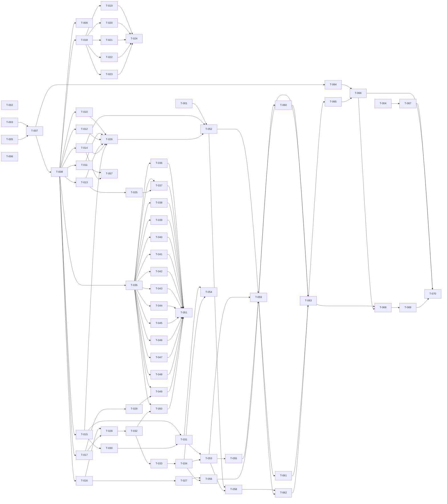

# Build Site

## Header / Totals

- Total kits: 5
- Total requirements: 31
- Total acceptance criteria: 152
- Total tasks generated: 64
- Total tiers: 7
- Tier 0 task count: 6 (run first in parallel)

Source kits:
- cavekit-topology-fold.md (R1-R10, 51 ACs)
- cavekit-loop-continuity.md (R1-R6, 22 ACs)
- cavekit-bug-sweep.md (R1-R5, 24 ACs)
- cavekit-deferred-todo.md (R1-R4, 29 ACs)
- cavekit-git-remote.md (R1-R6, 26 ACs)

---

## Tier 0 — No Dependencies (Start Here)

These tasks have no upstream dependencies and may execute in parallel.

| Task | Title | Cavekit | Requirement | blockedBy | Effort |
|------|-------|---------|-------------|-----------|--------|
| T-001 | Record pre-fold pytest baseline count under `context/refs/` | loop-continuity | R1 | none | S |
| T-002 | Verify `gh auth status` shows `CodexOperator` authenticated session | git-remote | R6 | none | S |
| T-003 | Create `agi-unification` feature branch in `~/.hermes/agi/` | git-remote | R1 | none | S |
| T-004 | Initialise `~/.hermes/agi-tree/` data repo remote and confirm clean working tree | git-remote | R3 | none | S |
| T-005 | Capture commit-message style conventions from prior origins (last 10 commits each) | git-remote | R6 | none | S |
| T-006 | Confirm legacy `~/autoresearch-tree/` exists on disk and `CodexOperator/autoresearch-tree` is not archived (pre-state baseline) | topology-fold | R10 | none | S |

## Tier 1 — Subtree Merge & Unified Repo Skeleton

| Task | Title | Cavekit | Requirement | blockedBy | Effort |
|------|-------|---------|-------------|-----------|--------|
| T-007 | Subtree-merge `~/autoresearch-tree/` history into `~/.hermes/agi/` preserving both origins | topology-fold | R6 | T-003, T-005 | M |
| T-008 | Create unified repo skeleton (`extensions/`, `skills/agi/`, root `README.md`, `TODO.md` placeholder) | topology-fold | R1 | T-007 | S |
| T-009 | Author `~/.hermes/agi/README.md` declaring "artificial graph intelligence", referencing "graph algorithms" and "research loop harness" | topology-fold | R1 | T-008 | S |

## Tier 2 — File Moves Into Unified Layout

All file moves are blocked on the skeleton existing.

| Task | Title | Cavekit | Requirement | blockedBy | Effort |
|------|-------|---------|-------------|-----------|--------|
| T-010 | Move engine `bin/` (snapshot, render, dispatch, heal, zoom, cli) into `extensions/agi/bin/` | topology-fold | R2 | T-008 | S |
| T-011 | Move engine `hooks/` (`cc-session-start.sh`) into `extensions/agi/hooks/` | topology-fold | R2 | T-008 | S |
| T-012 | Move engine `lib/` (`find-root.sh`, `agent-prompt.md`) into `extensions/agi/lib/` | topology-fold | R2 | T-008 | S |
| T-013 | Move engine `src/` subdirectories (graph_core, renderers, embeddings, schema_registry) into `extensions/agi/src/` | topology-fold | R2 | T-008 | S |
| T-014 | Move engine `tests/` into `extensions/agi/tests/` | topology-fold | R2 | T-008 | S |
| T-015 | Move engine entry points `driver.sh` (executable) and `conftest.py` into `extensions/agi/` | topology-fold | R2 | T-008 | S |
| T-016 | Move TypeScript bridge into `extensions/agi-bridge/` (`index.ts`, `README.md`) preserving `before_agent_start` registration | topology-fold | R3 | T-008 | S |
| T-017 | Move SKILL.md into `skills/agi/SKILL.md` (non-empty content preserved) | topology-fold | R4 | T-008 | S |
| T-018 | Create `extensions/agi/src/agi_algos/` package with `__init__.py` exporting public API of all five modules | topology-fold | R5 | T-008 | M |
| T-019 | Move `graph_builder.py` from hermes/agi root into `extensions/agi/src/agi_algos/graph_builder.py` | topology-fold | R5 | T-018 | S |
| T-020 | Move `query_engine.py` from hermes/agi root into `extensions/agi/src/agi_algos/query_engine.py` | topology-fold | R5 | T-018 | S |
| T-021 | Rename `_benchmark.py` to `benchmark.py` and move into `extensions/agi/src/agi_algos/benchmark.py`; ensure no `_benchmark.py` remains | topology-fold | R5 | T-018 | S |
| T-022 | Move `pi_tree_adapter.py` into `extensions/agi/src/agi_algos/pi_tree_adapter.py` | topology-fold | R5 | T-018 | S |
| T-023 | Move `asciirender.py` into `extensions/agi/src/agi_algos/asciirender.py` | topology-fold | R5 | T-018 | S |
| T-024 | Replace prior root-level paths with re-export stubs or remove cleanly when no external imports remain | topology-fold | R5 | T-019, T-020, T-021, T-022, T-023 | S |
| T-025 | Verify ascii renderer at `extensions/agi/src/renderers/ascii.py` survived the move (R7 coexistence path) | topology-fold | R7 | T-013 | S |

## Tier 3 — Path Hygiene, Manifest, CLI

| Task | Title | Cavekit | Requirement | blockedBy | Effort |
|------|-------|---------|-------------|-----------|--------|
| T-026 | Audit and remove any absolute references to `~/autoresearch-tree/` under `extensions/agi/` (use PLUGIN_ROOT/PROJECT_ROOT) | topology-fold | R2 | T-010, T-011, T-012, T-013, T-014, T-015 | S |
| T-027 | Audit and remove any absolute references to `~/autoresearch-tree/` under `extensions/agi-bridge/` | topology-fold | R3 | T-016 | S |
| T-028 | Author `~/.hermes/agi/package.json` with `pi.extensions` and `pi.skills` declarations | topology-fold | R1 | T-016, T-017 | S |
| T-029 | Update SKILL.md propagation recipe pointing at canonical `~/.hermes/agi/skills/agi/SKILL.md`; record in TODO | topology-fold | R4 | T-017 | S |
| T-030 | Update `~/.local/bin/agi` symlink to resolve to `~/.hermes/agi/extensions/agi/driver.sh` | topology-fold | R8 | T-015 | S |
| T-031 | Update `~/.local/bin/autoresearch-tree` symlink to resolve to same unified `driver.sh`; verify `--help` parity | topology-fold | R8 | T-015, T-030 | S |

## Tier 4 — Pi Discovery, Renderer Coexistence Note, TODO Authoring

| Task | Title | Cavekit | Requirement | blockedBy | Effort |
|------|-------|---------|-------------|-----------|--------|
| T-032 | Verify pi auto-discovery via `pi.extensions` glob; record verdict under `context/` or in TODO | topology-fold | R9 | T-028 | S |
| T-033 | If pi requires global registration, create `.pi/extensions/agi` and `.pi/extensions/agi-bridge` symlinks; otherwise confirm absence | topology-fold | R9 | T-032 | S |
| T-034 | Pi startup smoke against project using these extensions completes without "extension not found" | topology-fold | R9 | T-033 | S |
| T-035 | Author TODO.md skeleton with three section headings (algorithm, harness, fold-time decisions) | deferred-todo | R1 | T-008 | S |
| T-036 | Add TODO entry: data-source-agnostic refactor of `graph_builder.py` (description, rationale, evidence pointer, priority) | deferred-todo | R2 | T-035 | S |
| T-037 | Add TODO entry: ASCII renderer unification naming both `renderers/ascii.py` and `agi_algos/asciirender.py` | deferred-todo | R2, topology-fold R7 | T-035, T-025 | S |
| T-038 | Add TODO entry: DB-only state migration referencing `sqlite_backend.py` | deferred-todo | R2 | T-035 | S |
| T-039 | Add TODO entry: parsing `~/.hermes/agi-tree/nodes/{type}/*.md` into the DB as importable nodes | deferred-todo | R2 | T-035 | S |
| T-040 | Add TODO entry: replace `longest_chain_length` primary metric with composite/evidence-fraction metric | deferred-todo | R2 | T-035 | S |
| T-041 | Add TODO entry: orphan-verdict gate requiring `evidence_runs > 0` | deferred-todo | R2 | T-035 | S |
| T-042 | Add TODO entry: wire R11 loader path-safety bug citing commit `141df8d6` | deferred-todo | R2 | T-035 | S |
| T-043 | Add TODO entry: add `--iter-base N` flag to `dispatch.py` | deferred-todo | R2 | T-035 | S |
| T-044 | Add TODO entry: ship gensim+UMAP embedding stack to production renderer path | deferred-todo | R2 | T-035 | S |
| T-045 | Add TODO entry: remove legacy `~/autoresearch-tree/` directory after verification clears | deferred-todo | R2, topology-fold R10 | T-035 | S |
| T-046 | Add TODO entry: archive `github.com/CodexOperator/autoresearch-tree` with README pointer to `CodexOperator/agi` | deferred-todo | R2, topology-fold R10 | T-035 | S |
| T-047 | Add TODO entry: remove old fallback `~/.pi/agent/git/github.com/davebcn87/pi-autoresearch/extensions/autoresearch-tree/` after verification | deferred-todo | R2 | T-035 | S |
| T-048 | Add TODO entry: modularNN worktree cleanup at `~/.hermes/belam-codex-modularnn-spike-viz/` | deferred-todo | R2 | T-035 | S |
| T-049 | Add TODO entry: SKILL.md propagation recipe (5-location sync) updated for new canonical paths | deferred-todo | R2, topology-fold R4 | T-035, T-029 | S |
| T-050 | Add TODO entry: pi-extension symlink verdict (auto-discovery vs global registration) | deferred-todo | R2, topology-fold R9 | T-035, T-032 | S |
| T-051 | Sort/group entries so all P0 entries are locatable; ensure no entry requires external context; commit TODO.md (tracked, not gitignored) | deferred-todo | R3, R4 | T-036, T-037, T-038, T-039, T-040, T-041, T-042, T-043, T-044, T-045, T-046, T-047, T-048, T-049, T-050 | M |

## Tier 5 — Loop Continuity Verification (Post-Fold Surface)

| Task | Title | Cavekit | Requirement | blockedBy | Effort |
|------|-------|---------|-------------|-----------|--------|
| T-052 | Run pytest against `extensions/agi/tests/`; verify exit 0 and passing count >= baseline; no new skips/xfails | loop-continuity | R1 | T-001, T-014, T-026 | S |
| T-053 | Smoke run `agi --max-iters 1` against `~/.hermes/agi-tree/`; manifest produced with >=1 agent record | loop-continuity | R2 | T-031, T-034 | S |
| T-054 | Smoke run `autoresearch-tree --max-iters 1` against `~/.hermes/agi-tree/`; verify exit 0 (alias parity) | loop-continuity | R2 | T-031, T-034 | S |
| T-055 | Env-leak audit on R2 logs: no `api.anthropic.com`, no `Token Plan`, no HTTP 429; manifest provider == minimax | loop-continuity | R3 | T-053 | S |
| T-056 | Verify pi bridge load marker in startup logs; injected map header appears in `/autoresearch` agent prompt; content regenerates per turn | loop-continuity | R4 | T-027, T-034 | S |
| T-057 | Verify SessionStart hook fires in directory with config; INJECTION.md context injected; does not fire without config file | loop-continuity | R5 | T-011, T-014 | S |
| T-058 | Run loop with `~/.hermes/agi/` as project root for one iteration; verify exit 0, node source under `extensions/agi/`, file exists, type in registry | loop-continuity | R6 | T-052, T-053 | M |

## Tier 6 — Bug Sweep (Parallel Verification, Read-Only)

| Task | Title | Cavekit | Requirement | blockedBy | Effort |
|------|-------|---------|-------------|-----------|--------|
| T-059 | Dispatch parallel verification agents (4-6) with read-only instructions; document chosen subset; ensure pytest, smoke, env-leak, bridge-load coverage; each emits file:line evidence | bug-sweep | R1, R5 | T-052, T-053, T-055, T-056 | S |
| T-060 | Dispatch render-output sanity agent (project context map regenerates on agent turn) with file:line evidence | bug-sweep | R1 | T-059 | S |
| T-061 | Dispatch embeddings sanity agent (gensim + UMAP imports + smoke run) with file:line evidence | bug-sweep | R1 | T-059 | S |
| T-062 | Dispatch loop-against-self verification agent: report exit code, count of nodes whose source references `extensions/agi/`, name >=1 path that exists on disk | bug-sweep | R4 | T-058, T-059 | S |
| T-063 | Author aggregate report at `context/impl/bug-sweep-report.md`: every agent named, pass/fail recorded, file:line evidence for failures; gate merge accordingly; verify no writes occurred under code-under-test paths or `agi-tree/` (only commits under `context/impl/`) | bug-sweep | R2, R3, R5 | T-059, T-060, T-061, T-062 | M |

## Tier 7 — Push, Archive, Final Verification (Gated on Bug-Sweep Clearance)

| Task | Title | Cavekit | Requirement | blockedBy | Effort |
|------|-------|---------|-------------|-----------|--------|
| T-064 | Configure `~/.hermes/agi/` origin remote referencing `CodexOperator/agi`; ensure exactly one origin | git-remote | R2, R5 | T-007 | S |
| T-065 | Merge `agi-unification` feature branch into main only after bug-sweep records all checks passing | git-remote | R1 | T-063 | S |
| T-066 | Push `~/.hermes/agi/` main; verify local tip == remote tip; `git log origin/main..HEAD` empty; pushed history contains commit hashes from both prior origins; `gh repo view CodexOperator/agi` shows content | git-remote | R2, R5, topology-fold R6 | T-064, T-065 | S |
| T-067 | Push `~/.hermes/agi-tree/` main verbatim; verify exactly one origin == `CodexOperator/agi-tree`; local tip == remote tip; `git log origin/main..HEAD` empty; no project-data file modifications | git-remote | R3, R5 | T-004 | S |
| T-068 | Update README of `CodexOperator/autoresearch-tree` with pointer to `CodexOperator/agi` (pre-archive) | git-remote | R4, topology-fold R10 | T-063, T-066 | S |
| T-069 | Archive `github.com/CodexOperator/autoresearch-tree`; verify `gh repo view` reports archived; legacy local `~/autoresearch-tree/` directory and its remote config left untouched | git-remote | R4, R5, topology-fold R10 | T-068 | S |
| T-070 | Final verification sweep: confirm commit-message conventions held on feature branch; no credential prompts during push; both repos clean | git-remote | R5, R6 | T-066, T-067, T-069 | S |

---

## Summary Table

| Tier | Tasks | S | M | L |
|------|-------|---|---|---|
| Tier 0 | 6 | 6 | 0 | 0 |
| Tier 1 | 3 | 2 | 1 | 0 |
| Tier 2 | 16 | 15 | 1 | 0 |
| Tier 3 | 6 | 6 | 0 | 0 |
| Tier 4 | 17 | 16 | 1 | 0 |
| Tier 5 | 7 | 6 | 1 | 0 |
| Tier 6 | 5 | 4 | 1 | 0 |
| Tier 7 | 7 | 7 | 0 | 0 |
| **Total** | **67** | **62** | **5** | **0** |

Note: T-numbering runs 001-070 with 67 distinct tasks across 8 tiers (Tier 0 through Tier 7).

---

## Coverage Matrix

Every acceptance criterion across all five kits is enumerated below with assigned task(s) and COVERED/GAP status.

### cavekit-topology-fold.md (51 ACs)

#### R1: Unified repo at ~/.hermes/agi/

| AC | Description | Task(s) | Status |
|----|-------------|---------|--------|
| R1.1 | README contains "artificial graph intelligence" | T-009 | COVERED |
| R1.2 | README references "graph algorithms" and "research loop harness" | T-009 | COVERED |
| R1.3 | package.json has `pi.extensions` and `pi.skills` | T-028 | COVERED |
| R1.4 | `extensions/agi/` exists | T-008 | COVERED |
| R1.5 | `extensions/agi-bridge/` exists | T-008, T-016 | COVERED |
| R1.6 | `skills/agi/SKILL.md` exists | T-017 | COVERED |
| R1.7 | `TODO.md` exists at repo root | T-035 | COVERED |

#### R2: Engine extension folded into extensions/agi/

| AC | Description | Task(s) | Status |
|----|-------------|---------|--------|
| R2.1 | `driver.sh` exists and is executable | T-015 | COVERED |
| R2.2 | `conftest.py` exists | T-015 | COVERED |
| R2.3 | `bin/` contains snapshot, render, dispatch, heal, zoom, cli | T-010 | COVERED |
| R2.4 | `hooks/cc-session-start.sh` exists | T-011 | COVERED |
| R2.5 | `lib/find-root.sh` exists | T-012 | COVERED |
| R2.6 | `lib/agent-prompt.md` exists | T-012 | COVERED |
| R2.7 | `src/` subdirectories present | T-013 | COVERED |
| R2.8 | `tests/` files present | T-014 | COVERED |
| R2.9 | No absolute `~/autoresearch-tree/` paths under `extensions/agi/` | T-026 | COVERED |

#### R3: Bridge extension folded into extensions/agi-bridge/

| AC | Description | Task(s) | Status |
|----|-------------|---------|--------|
| R3.1 | `index.ts` exists | T-016 | COVERED |
| R3.2 | `README.md` exists | T-016 | COVERED |
| R3.3 | `index.ts` registers `before_agent_start` | T-016 | COVERED |
| R3.4 | No absolute `~/autoresearch-tree/` paths under `extensions/agi-bridge/` | T-027 | COVERED |

#### R4: SKILL.md folded into skills/agi/

| AC | Description | Task(s) | Status |
|----|-------------|---------|--------|
| R4.1 | `skills/agi/SKILL.md` exists | T-017 | COVERED |
| R4.2 | Content non-empty | T-017 | COVERED |
| R4.3 | TODO.md entry references propagation recipe + canonical source path | T-029, T-049 | COVERED |

#### R5: hermes/agi root algorithms moved into src/agi_algos/

| AC | Description | Task(s) | Status |
|----|-------------|---------|--------|
| R5.1 | `agi_algos/__init__.py` exists | T-018 | COVERED |
| R5.2 | `graph_builder.py` exists | T-019 | COVERED |
| R5.3 | `query_engine.py` exists | T-020 | COVERED |
| R5.4 | `benchmark.py` exists | T-021 | COVERED |
| R5.5 | No `_benchmark.py` remains | T-021 | COVERED |
| R5.6 | `pi_tree_adapter.py` exists | T-022 | COVERED |
| R5.7 | `asciirender.py` exists | T-023 | COVERED |
| R5.8 | `__init__.py` exports public symbols of five modules | T-018 | COVERED |
| R5.9 | Prior root paths absent or re-export stubs only | T-024 | COVERED |

#### R6: Subtree-merged history preserves both origins

| AC | Description | Task(s) | Status |
|----|-------------|---------|--------|
| R6.1 | Git log contains commit hash from prior `~/.hermes/agi/` history | T-007 | COVERED |
| R6.2 | Git log contains commit hash from prior `~/autoresearch-tree/` history | T-007 | COVERED |
| R6.3 | Git log contains pre-fold commit messages from each origin | T-007 | COVERED |

#### R7: Two ASCII renderers coexist

| AC | Description | Task(s) | Status |
|----|-------------|---------|--------|
| R7.1 | `renderers/ascii.py` exists | T-013, T-025 | COVERED |
| R7.2 | `agi_algos/asciirender.py` exists | T-023 | COVERED |
| R7.3 | `pi_tree_adapter.py` exists | T-022 | COVERED |
| R7.4 | TODO.md names both renderer paths and describes deferred unification | T-037 | COVERED |

#### R8: Both CLI binaries resolve to unified driver

| AC | Description | Task(s) | Status |
|----|-------------|---------|--------|
| R8.1 | `~/.local/bin/agi` resolves to unified `driver.sh` | T-030 | COVERED |
| R8.2 | `~/.local/bin/autoresearch-tree` resolves to unified `driver.sh` | T-031 | COVERED |
| R8.3 | `agi --help` and `autoresearch-tree --help` produce identical output | T-031 | COVERED |

#### R9: Pi auto-discovery verified; symlinks created only if required

| AC | Description | Task(s) | Status |
|----|-------------|---------|--------|
| R9.1 | Verification record exists under `context/` or in TODO.md | T-032 | COVERED |
| R9.2 | If auto-discovers, no `.pi/extensions/` symlinks present | T-033 | COVERED |
| R9.3 | If global registration required, both symlinks resolve correctly | T-033 | COVERED |
| R9.4 | Pi startup completes without "extension not found" | T-034 | COVERED |

#### R10: Legacy retained until verification clears

| AC | Description | Task(s) | Status |
|----|-------------|---------|--------|
| R10.1 | Until clearance, `~/autoresearch-tree/` exists | T-006 | COVERED |
| R10.2 | Until clearance, github mirror not archived | T-006 | COVERED |
| R10.3 | After clearance, mirror is archived | T-069 | COVERED |
| R10.4 | After clearance, archived README points to `CodexOperator/agi` | T-068 | COVERED |
| R10.5 | TODO.md has entries for local removal and mirror archival with priority labels | T-045, T-046 | COVERED |

### cavekit-loop-continuity.md (22 ACs)

#### R1: All existing tests pass post-fold

| AC | Description | Task(s) | Status |
|----|-------------|---------|--------|
| R1.1 | Pre-fold baseline file under `context/refs/` | T-001 | COVERED |
| R1.2 | pytest exits 0 | T-052 | COVERED |
| R1.3 | Passing count >= baseline | T-052 | COVERED |
| R1.4 | No new skips/xfails | T-052 | COVERED |

#### R2: Single-iteration smoke run

| AC | Description | Task(s) | Status |
|----|-------------|---------|--------|
| R2.1 | `agi --max-iters 1` exits 0 | T-053 | COVERED |
| R2.2 | `autoresearch-tree --max-iters 1` exits 0 | T-054 | COVERED |
| R2.3 | iter-NNN session manifest created | T-053 | COVERED |
| R2.4 | Manifest contains >=1 agent record | T-053 | COVERED |

#### R3: No LLM-quota leak

| AC | Description | Task(s) | Status |
|----|-------------|---------|--------|
| R3.1 | No `api.anthropic.com` substring | T-055 | COVERED |
| R3.2 | No `Token Plan` substring | T-055 | COVERED |
| R3.3 | No HTTP 429 markers | T-055 | COVERED |
| R3.4 | Manifest provider == minimax (not anthropic) | T-055 | COVERED |

#### R4: Pi bridge extension still loads

| AC | Description | Task(s) | Status |
|----|-------------|---------|--------|
| R4.1 | Pi startup logs contain agi-bridge load marker | T-056 | COVERED |
| R4.2 | `/autoresearch` agent prompt contains injected map header | T-056 | COVERED |
| R4.3 | Injected content regenerates each turn | T-056 | COVERED |

#### R5: SessionStart hook still injects context

| AC | Description | Task(s) | Status |
|----|-------------|---------|--------|
| R5.1 | Hook executes when config file present | T-057 | COVERED |
| R5.2 | INJECTION.md content present in initial context | T-057 | COVERED |
| R5.3 | No injection without config file | T-057 | COVERED |

#### R6: Loop researches its own AGI code

| AC | Description | Task(s) | Status |
|----|-------------|---------|--------|
| R6.1 | One iteration with `~/.hermes/agi/` root exits 0 | T-058 | COVERED |
| R6.2 | At least one node's source under `extensions/agi/` | T-058 | COVERED |
| R6.3 | Path corresponds to existing file | T-058 | COVERED |
| R6.4 | Node type is in registry | T-058 | COVERED |

### cavekit-bug-sweep.md (24 ACs)

#### R1: Parallel verification agents dispatched

| AC | Description | Task(s) | Status |
|----|-------------|---------|--------|
| R1.1 | At least 4 agents dispatched | T-059, T-060, T-061, T-062 | COVERED |
| R1.2 | At most 6 agents dispatched | T-059, T-060, T-061, T-062 | COVERED |
| R1.3 | Pytest agent runs and reports | T-059 | COVERED |
| R1.4 | Smoke loop agent runs and reports | T-059 | COVERED |
| R1.5 | Env-leak audit agent runs and reports | T-059 | COVERED |
| R1.6 | Bridge-extension load check agent runs and reports | T-059 | COVERED |
| R1.7 | Each report has file:line evidence | T-059, T-060, T-061, T-062 | COVERED |
| R1.8 | Chosen subset documented in aggregate report | T-063 | COVERED |

#### R2: Aggregate report committed

| AC | Description | Task(s) | Status |
|----|-------------|---------|--------|
| R2.1 | `context/impl/bug-sweep-report.md` exists | T-063 | COVERED |
| R2.2 | Report names every agent that ran | T-063 | COVERED |
| R2.3 | Pass/fail per agent recorded | T-063 | COVERED |
| R2.4 | Failing agents include cited file:line evidence | T-063 | COVERED |

#### R3: Failures block merge

| AC | Description | Task(s) | Status |
|----|-------------|---------|--------|
| R3.1 | If any check failed, branch not merged | T-063, T-065 | COVERED |
| R3.2 | If all checks pass, merge permitted | T-063, T-065 | COVERED |
| R3.3 | No "loop green" declaration while a failure stands | T-063 | COVERED |

#### R4: Loop-against-self verification

| AC | Description | Task(s) | Status |
|----|-------------|---------|--------|
| R4.1 | Agent runs loop with `~/.hermes/agi/` as root | T-062 | COVERED |
| R4.2 | Report states exit code (== 0) | T-062 | COVERED |
| R4.3 | Report counts nodes with source under `extensions/agi/` | T-062 | COVERED |
| R4.4 | Reported count >= 1 | T-062 | COVERED |
| R4.5 | At least one named path corresponds to existing file | T-062 | COVERED |

#### R5: Verification agents are read-only

| AC | Description | Task(s) | Status |
|----|-------------|---------|--------|
| R5.1 | No file under specified code-under-test paths modified | T-059, T-063 | COVERED |
| R5.2 | No file under `~/.hermes/agi-tree/` modified | T-059, T-063 | COVERED |
| R5.3 | No commits in those repos except under `context/impl/` | T-063 | COVERED |
| R5.4 | Each agent's instructions explicitly forbid writes | T-059 | COVERED |

### cavekit-deferred-todo.md (29 ACs)

#### R1: TODO file exists with three sections

| AC | Description | Task(s) | Status |
|----|-------------|---------|--------|
| R1.1 | `TODO.md` exists | T-035 | COVERED |
| R1.2 | Section heading: AGI-side algorithm work | T-035 | COVERED |
| R1.3 | Section heading: harness-side work | T-035 | COVERED |
| R1.4 | Section heading: decisions deferred during fold | T-035 | COVERED |
| R1.5 | Every entry has short description | T-051 | COVERED |
| R1.6 | Every entry has rationale | T-051 | COVERED |
| R1.7 | Every entry has evidence pointer | T-051 | COVERED |
| R1.8 | Every entry has priority label P0/P1/P2 | T-051 | COVERED |

#### R2: TODO file covers required entries

| AC | Description | Task(s) | Status |
|----|-------------|---------|--------|
| R2.1 | data-source-agnostic refactor of `graph_builder.py` | T-036 | COVERED |
| R2.2 | ASCII renderer unification (both paths named) | T-037 | COVERED |
| R2.3 | DB-only state migration referencing `sqlite_backend.py` | T-038 | COVERED |
| R2.4 | parsing `agi-tree/nodes/{type}/*.md` into DB | T-039 | COVERED |
| R2.5 | replace `longest_chain_length` primary metric | T-040 | COVERED |
| R2.6 | orphan-verdict gate `evidence_runs > 0` | T-041 | COVERED |
| R2.7 | wire R11 loader path-safety bug citing `141df8d6` | T-042 | COVERED |
| R2.8 | add `--iter-base N` flag to `dispatch.py` | T-043 | COVERED |
| R2.9 | ship gensim+UMAP embedding stack | T-044 | COVERED |
| R2.10 | remove legacy `~/autoresearch-tree/` directory | T-045 | COVERED |
| R2.11 | archive `CodexOperator/autoresearch-tree` with README pointer | T-046 | COVERED |
| R2.12 | remove old fallback under `~/.pi/agent/git/...` | T-047 | COVERED |
| R2.13 | modularNN worktree cleanup | T-048 | COVERED |
| R2.14 | SKILL.md propagation recipe (5-location) updated | T-049 | COVERED |
| R2.15 | pi-extension symlink decision recorded | T-050 | COVERED |

#### R3: TODO file committed to unified repo

| AC | Description | Task(s) | Status |
|----|-------------|---------|--------|
| R3.1 | `TODO.md` tracked in `git ls-files` | T-051 | COVERED |
| R3.2 | Present at branch tip pushed to origin | T-051, T-066 | COVERED |
| R3.3 | Not listed in `.gitignore` | T-051 | COVERED |

#### R4: TODO file is actionable as checklist

| AC | Description | Task(s) | Status |
|----|-------------|---------|--------|
| R4.1 | Each description names paths/modules or evidence pointer does | T-051 | COVERED |
| R4.2 | No description requires consulting external docs | T-051 | COVERED |
| R4.3 | P0 entries locatable without reading every entry | T-051 | COVERED |

### cavekit-git-remote.md (26 ACs)

#### R1: Fold work lands on feature branch

| AC | Description | Task(s) | Status |
|----|-------------|---------|--------|
| R1.1 | Branch named `agi-unification` (or `agi-unification-*`) exists | T-003 | COVERED |
| R1.2 | All fold commits reachable from feature branch | T-003, T-007 | COVERED |
| R1.3 | No fold commits on main before bug-sweep clears | T-065 | COVERED |
| R1.4 | Merge into main only after bug-sweep records all checks passing | T-065 | COVERED |

#### R2: Unified repo initialised against CodexOperator/agi and pushed

| AC | Description | Task(s) | Status |
|----|-------------|---------|--------|
| R2.1 | `git remote -v` lists origin referencing `CodexOperator/agi` | T-064 | COVERED |
| R2.2 | Local main tip == remote main tip | T-066 | COVERED |
| R2.3 | `git log origin/main..HEAD` empty | T-066 | COVERED |
| R2.4 | Pushed history contains hashes from both prior origins | T-066 | COVERED |
| R2.5 | `gh repo view CodexOperator/agi` shows new repo with content | T-066 | COVERED |

#### R3: Data repo initialised against CodexOperator/agi-tree and pushed verbatim

| AC | Description | Task(s) | Status |
|----|-------------|---------|--------|
| R3.1 | `git remote -v` references `CodexOperator/agi-tree` | T-004, T-067 | COVERED |
| R3.2 | Local main tip == remote main tip | T-067 | COVERED |
| R3.3 | `git log origin/main..HEAD` empty | T-067 | COVERED |
| R3.4 | No commits modify project data files | T-067 | COVERED |

#### R4: Legacy github mirror archived after verification clears

| AC | Description | Task(s) | Status |
|----|-------------|---------|--------|
| R4.1 | Until clearance, `gh repo view` does not report archived | T-006 | COVERED |
| R4.2 | After clearance, archived status reported | T-069 | COVERED |
| R4.3 | Pre-archival README points to `CodexOperator/agi` | T-068 | COVERED |
| R4.4 | Local `~/autoresearch-tree/` git remote config unchanged | T-069 | COVERED |

#### R5: Verification of remotes and push completeness

| AC | Description | Task(s) | Status |
|----|-------------|---------|--------|
| R5.1 | `git remote -v` in agi: exactly one origin == CodexOperator/agi | T-064, T-070 | COVERED |
| R5.2 | `git remote -v` in agi-tree: exactly one origin == CodexOperator/agi-tree | T-067, T-070 | COVERED |
| R5.3 | `git log origin/main..HEAD` empty in agi after final push | T-066, T-070 | COVERED |
| R5.4 | `git log origin/main..HEAD` empty in agi-tree after final push | T-067, T-070 | COVERED |
| R5.5 | `gh repo view CodexOperator/agi` shows new repo with content | T-066, T-070 | COVERED |
| R5.6 | `gh repo view CodexOperator/autoresearch-tree` reports archived | T-069, T-070 | COVERED |

#### R6: GitHub auth via CodexOperator and consistent commit style

| AC | Description | Task(s) | Status |
|----|-------------|---------|--------|
| R6.1 | `gh auth status` reports authenticated CodexOperator session | T-002 | COVERED |
| R6.2 | No credential prompt during push | T-066, T-067, T-070 | COVERED |
| R6.3 | Commit messages match prior origins' last-10-commits style | T-005, T-070 | COVERED |

### Coverage Summary

- Total acceptance criteria: 152
- COVERED: 152
- GAP: 0
- Coverage percentage: 100%

---

## Dependency Graph

---

## Notes

- Tier 0 contains 6 tasks (T-001 through T-006) that may run in parallel before any other work.
- The subtree merge (T-007) is the keystone that unblocks all file-move work.
- TODO authoring (T-035 through T-051) runs in parallel with verification work — T-035 is unblocked once the skeleton lands at T-008, and T-051 only blocks T-066 indirectly via the push.
- Bug-sweep verification (Tier 6) is read-only and gates the merge (T-065) and the legacy archive (T-068, T-069).
- Final remote pushes are gated on bug-sweep clearance per the kit cross-references.
- Effort distribution skews S; only T-007, T-018, T-051, T-058, T-063 are M. No L tasks — anything larger has been split.

## Changelog

_(empty)_
