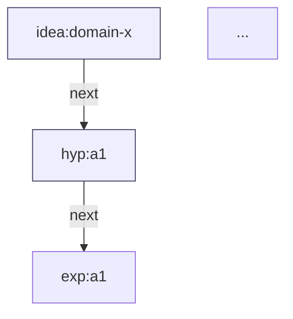

**MVP: `src/chain_engine/renderers/mermaid.py`**

## What It Does

Exports `render_mermaid_chains(chains, max_chains=10)` which takes a list of chains (each chain is a list of node id strings) and returns a Mermaid `flowchart TD` string.

## Interface

```python
from chain_engine.renderers.mermaid import render_mermaid_chains

chains = [
    ["idea:a", "hyp:a1", "exp:a1", "verdict:a1", "mvp:a1", "outcome:a1", "bigger-outcome:a1", "app-purpose:a1"],
    ["idea:b", "hyp:b1", "exp:b1", "verdict:b1", "mvp:b1", "outcome:b1", "bigger-outcome:b1", "app-purpose:b1"],
]
mermaid_code = render_mermaid_chains(chains, max_chains=10)
print(mermaid_code)
```

## Output Format



## Key Design Decisions

- **Isomorphic Representation**: builds `Representation` (shared type used by all renderers) so no duplication
- **Type inference**: derives node type from `id:` prefix (e.g. `"idea:x"` → type `"idea"`)
- **Deduplication**: nodes shared across chains appear once in output
- **max_chains**: limits rendering to top-N chains (default 10)
- **Next edges**: `|next|` edge labels between consecutive chain nodes

## Input Shape

- `chains`: `list[list[str]]` — each inner list is an ordered sequence of node ids
- `max_chains`: `int | None` — limit chains rendered (None = all)

## Output Shape

- Single `str` — Mermaid `flowchart TD` syntax (UTF-8, no BOM)
